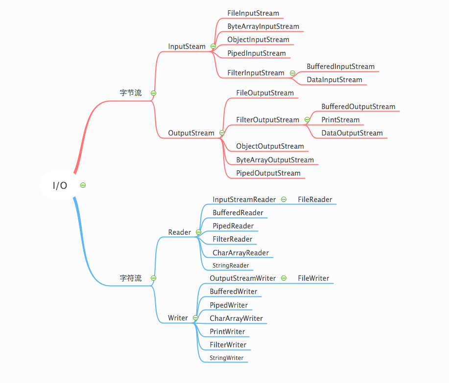

编程语言的I/O库中常使用‘流’这个抽象概念，他代表任何又能路产生数据的数据源对象或有能力接收数据的接收端对象；在java中从数据的传输方式看 “流”分为 字节流和字符流两类 如下所示


# InputStream 方法简介
名称|返回值|说明
---|---|---
read()|int|输入流中读取下一个字节数据，返回读取的字节数据，返回-1表示读取完成
read(byte b[]) | int | 输入流中读取0-b.length()个字节的数据，并将数据存储在b中，返回读取的字节数或-1表示读取完成
available() | int | 可读取的字节数
read(byte b[], int off, int len)| int |  `len` 读取的字节数 `b[]` 存储读取的字节 `off` 数据存储在`b[]`中的开始位置,输入流中读取len个字节存储在b[]中，返回读入b[]中的总字节数，返回-1表示已经读取完成  
readNBytes(int len) | byte[]| 流中读取指定数量的字节，返回读取的数据
readNBytes(byte[] b, int off, int len)|int| `len` 读取的字节数 `b[]` 存储读取的字节 `off` 数据存储在`b[]`中的开始位置,输入流中读取len个字节存储在b[]中，返回读取的实际字节数；该方法调用`read(byte b[], int off, int len)` 实现
skip(long n)|long| 跳过并丢弃输入流中的n个字节
close()|-|关闭此输入流，并释放与该流关联的任何系统资源

# 示例
使用 `FileInputStream` 读取文件内容
```java
package club.yuit.io;

import lombok.extern.slf4j.Slf4j;

import java.io.*;
import java.net.URI;
import java.net.URISyntaxException;
import java.nio.channels.FileChannel;

/**
 * @author yuit
 * @date 2020/5/12 下午4:06
 */
@Slf4j
public class StreamUtil {

    public static void readFileData() throws URISyntaxException, IOException {
        File file = new File(new URI("file:///Users/yuit/welfare.json"));
        FileInputStream in = new FileInputStream(file);
        long fLength  = file.length();
        int len = 512;
        if (cLength<len){
            len = cLength;
        }
        byte[] bf = new byte[len];
        while (in.read(bf,0,len)!=-1){
            String d = new String(bf);
            log.info("\n{}",d);
        }

        in.close();
    }
}
```

# OutputStream 方法简介
名称|返回值|说明
---|---|---
write(int b)|-| 写入指定字节的数
write(byte b[])| -| 将数据写入输出流
write(byte b[], int off, int len)|-| 将字节数据`b[]`的 `off`-`len`写到输出流中
flush()|-|刷新此输出流，并强制写出所有缓冲的输出字节
close()|-|关闭此输出流并释放与此流关联的所有系统资源

# 示例 
使用 `FileOutputStream` 将数据追加到文件中
```java
    public static void writerFile() throws IOException {
        File file = new File("./data.txt");

        log.info("文件路径：{}",file.getAbsolutePath());

        // 数据追加
        OutputStream ot = new FileOutputStream(file,true);
        String data = "写入的数据";
        ot.write(data.getBytes());
        ot.close();

    }
```


# Reader
名称|返回值|说明
---|---|---
read()| int| 读取字符，范围为​​0到65535 （ 0x00-0xffff）中的整数，如果已到达流的结尾，则为-1。
read(java.nio.CharBuffer target)|int| 尝试将字符读入指定的字符缓冲区，返回添加到缓冲区的字符数
read(char cbuf[])|int|将字符读入数组，返回读取的字符数
read(char cbuf[], int off, int len)|int|将字符读入数组 `off`为`cbuf[]`的偏移量，`len` 读取的字符数
skip(long n)|long|跳过指定字符数
ready()|boolean|此流是否已准备好被读取
mark(int readAheadLimit)|-|标记流中的当前位置,可使用reset()重置到当前位置继续读取数据
markSupported()|boolean|是否支持mark（）操作
reset()|-|重置流。如果流已被标记，尝试将其重新定位在标记处
close()|-|关闭流并释放与其相关的所有系统资源

# 示例
使用`BufferedReader` 读取文件数据
```java
public static void reader() throws IOException {
    File file = new File("./data.txt");
    FileReader fileReader = new FileReader(file,StandardCharsets.UTF_8);
    BufferedReader bfr =new BufferedReader(fileReader);
    String str = null;
    StringBuffer sbf=new StringBuffer();
    while ((str=bfr.readLine())!=null){
        sbf.append(str);
    }

    log.info("\n{}",sbf.toString());
    fileReader.close();
    bfr.close();
}
```

# Writer
名称|返回值|说明
---|---|---
write(int c)| -| 写入一个字符
write(char cbuf[])|-| 输出流写入字符数组
write(char cbuf[], int off, int len)|-|输出流写入字符数组，`off`要写入数据`cbuf`的偏移量，`len`要写入的数据长度
write(String str)|-|写入一个字符串
write(String str, int off, int len)|-|写入特定长度的字符串，`off` 为`str`的偏移量,`len`要写入的长度
append(CharSequence csq)|Writer|追加方式写入字符序列
append(CharSequence csq, int start, int end)|Writer|将`seq`的子序列追加方式写入
append(char c)|Writer|追加写入一个字符
flush()|-|刷新缓冲区
close()|-|关闭流

# 示例
使用`BufferedWriter` 写文件数据

```java
public static void writer(String data) throws IOException {
    File file = new File("./data.txt");
        // 追加方式写入
    FileWriter writer = new FileWriter(file,StandardCharsets.UTF_8,true);
    BufferedWriter bfw = new BufferedWriter(writer);
    bfw.write(data);
    bfw.close();

}

```