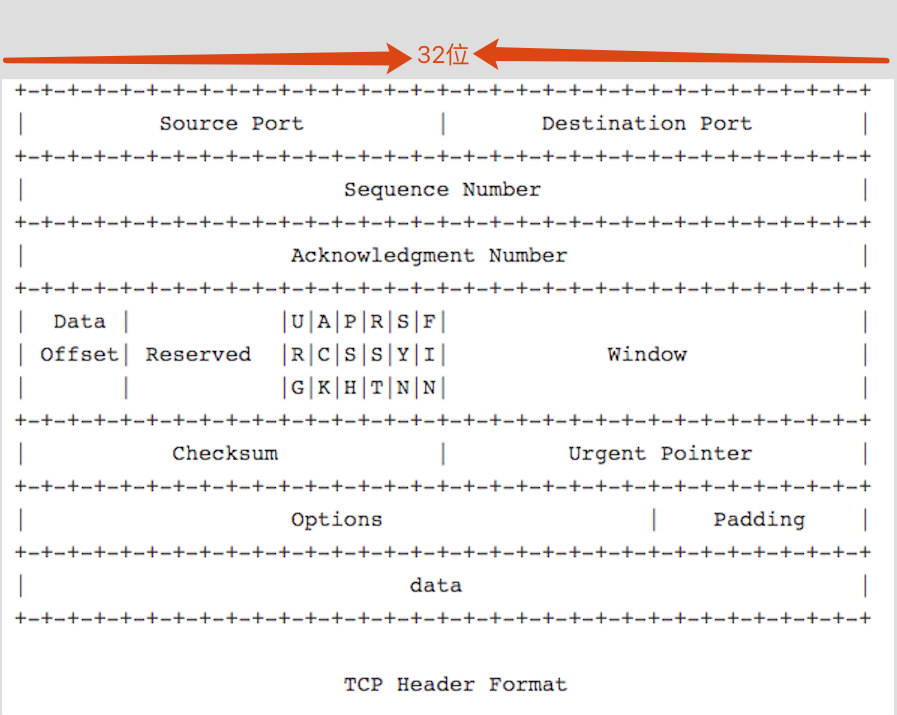
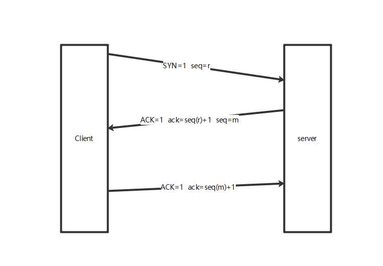
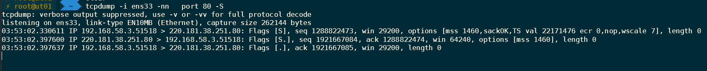
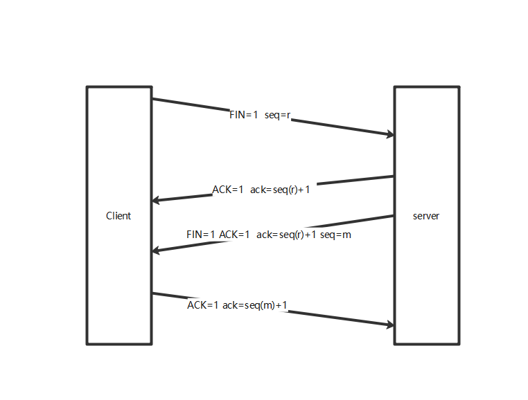
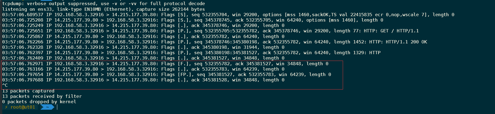

# 网络协议

# OSI（Open System Interconnect）七层模型
1. 应用层（为应用程序提供服务）
2. 表示层（数据格式转换，数据加密）
3. 会话层（建立、管理和维护回话）
4. 传输层（建立、管理和维护端到端的连接）
5. 网络层（IP选址和路由选择）
6. 数据链路层（提供介质和链路管理）
7. 物理层


# TCP/IP 四层模型 和 OSI七层模型的对比

<table>
    <th>OSI七层模型</th>
    <th>TCP/IP 四层模型</th>
    <th>协议</th>
    <tbody>
        <tr>
            <td>应用层</td>
            <td rowspan='3'>应用层</td>
            <td rowspan='3'>HTTP、TFTP, FTP, NFS, WAIS<br>SMTP,Telnet, 
            Rlogin, SNMP, Gopher,DNS</td>
        </tr>
        <tr>
            <td>表示层</td>
        </tr>
        <tr>
             <td>会话层</td>
        </tr>
        <tr>
             <td>传输层</td>
             <td>传输层</td>
             <td>TCP, UDP</td>
        </tr>
        <tr>
             <td>网络层</td>
             <td>网络层</td>
             <td>IP, ICMP, ARP, RARP, AKP, UUCP</td>
        </tr>
        <tr>
            <td>数据链路层</td>
            <td rowspan='2'>网络接口层</td>
            <td rowspan='2'>FDDI, Ethernet, Arpanet, PDN, SLIP, PPP,IEEE 802.1A, IEEE 802.2到IEEE 802.1</td>
        </tr>
        <tr>
             <td>物理层</td>
        </tr>
    </tbody>
</table>

OSI 七层模型是 ISO (国际标准化组织)推出的参考理论模型，TCP/IP 参考OSI建立的四层模型为使用广泛的事实标准

# TCP 协议
`面向连接`,`可靠`的,基于字节流的网络传输协议



```
Source port             源端口号         16位
Destination Port        目的端口         16位
Sequence Number         序列号           32位
Acknowledgment Number   确认号           32位
Data Offset             TCP头部长度      4位
Reserved                保留            6位
------------------------标志位-----------------
URG                     紧急指针是否有效      1位
ACK                     确认号是否有效       1位
PSH                     立即从缓冲区读取数据  1位
SYN                     建立连接            1位
FIN                     关闭连接            1位
----------------------------------------------
Window                  窗口大小，通知对方本端的缓冲区还能接收的字节数，可用来控制流量  16位
Checksnum               校验和，由发送端填写，接收端通过CRC算法检验保温是否损坏，校验部分包括（头部，数据） 16位
Urgnet Pointer          紧急指针            16位
Options                 选项，最大40位
Padding                 填充，确保报文正确结束
data                    数据
```

### 建立连接的三次握手

client----SYN---> server   客户端向服务端发送tcp数据包其中SYN=1，告诉服务端客户端要发起连接
Server-SYN+ACK--> client   服务向客户端发送tcp数据包 SYN=1，ACK=1，告诉客户端，服务端准备好了可以连接
client---ACK---->server    客户端向服务端发送tcp数据包  ACK=1，告诉服务端，客户端也准备好了，服务端收到后双方在内存中创建资源，此时连接建立成功。

三次握手确保客户端和服务之间的双向通信没有问题，在下图中使用tcpdump抓取三次握手包的验证


### 断开连接的四次握手



三次握手和四次挥手的数据包都是由OS内核生成.

# 套接字 Socket
Socket 对应四元组信息，源IP:源端口<-->目的IP:目的端口