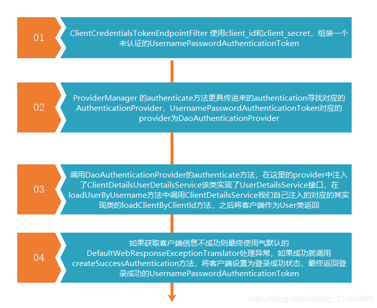
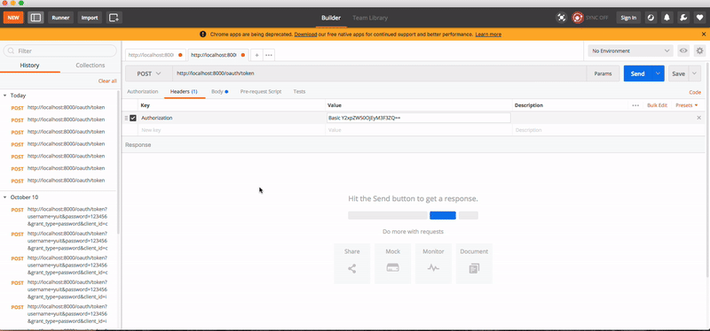

上篇 [Spring boot+Security OAuth2 爬坑日记（3）自定义登录和授权页面](./自定义登录和授权页面.MD)

为了方便与前端更好的交互，服务端要提供友好统一的信息返回格式，（他好我也好 ->_-> ），Spring Security OAuth2 提供了自定义异常的入口；我们需要做的就是实现对应的接口，然后将实现的类配置到对应的入口即可。默认的信息返回格式如下：

```json
{
    "error": "invalid_grant",
    "error_description": "Bad credentials"
}
```

需要处理的其实就两个地方的异常信息，分别是`认证服务器的异常信息`和`资源服务器的异常信息`；现在就从这两个地方入手

#### 认证服务器已异常处理
自定义 `ExceptionTranslator` 实现认证服务器的异常信息处理，新建类 `BootOAuth2WebResponseExceptionTranslator` 实现`WebResponseExceptionTranslator` 接口，实现其`ResponseEntity<OAuth2Exception> translate(Exception e)`方法；认证发生的异常在这里能捕获到，在这里我们可以将我们的异常信息封装成统一的格式返回即可，这里怎么处理因项目而异，这里我直接复制了`DefaultWebResponseExceptionTranslator` 实现方法，我这里要处理的格式如下：
```json
{
	"status":401,
	"msg":"xxxxxxxxxxxxxxxxxxxxxxxxxxxxmsg"
}
```
1. 定义自己的`OAuth2Exception` 
	```java
	@JsonSerialize(using = BootOAuthExceptionJacksonSerializer.class)
	public class BootOAuth2Exception extends OAuth2Exception {
	    public BootOAuth2Exception(String msg, Throwable t) {
	        super(msg, t);
	    }
	
	    public BootOAuth2Exception(String msg) {
	        super(msg);
	    }
	}	
	```
    
2.  定义异常`BootOAuth2Exception` 的序列化类
	```java
		public class BootOAuthExceptionJacksonSerializer extends StdSerializer<BootOAuth2Exception> {
	
        	protected BootOAuthExceptionJacksonSerializer() {
        	   super(BootOAuth2Exception.class);
        	}
    	
    	    @Override
            public void serialize(BootOAuth2Exception value, JsonGenerator jgen, SerializerProvider serializerProvider) throws IOException {
                jgen.writeStartObject();
                jgen.writeObjectField("status", value.getHttpErrorCode());
                String errorMessage = value.getOAuth2ErrorCode();
                if (errorMessage != null) {
                    errorMessage = HtmlUtils.htmlEscape(errorMessage);
                }
                jgen.writeStringField("msg", errorMessage);
                if (value.getAdditionalInformation()!=null) {
                    for (Map.Entry<String, String> entry : value.getAdditionalInformation().entrySet()) {
                        String key = entry.getKey();
                        String add = entry.getValue();
                        jgen.writeStringField(key, add);
                    }
                }
                jgen.writeEndObject();
            }
	}
	```

3. 定义自己的`WebResponseExceptionTranslator` 类名为`BootOAuth2WebResponseExceptionTranslator`
    ```java
    @Component("bootWebResponseExceptionTranslator")
    public class BootOAuth2WebResponseExceptionTranslator implements WebResponseExceptionTranslator {
    
        private ThrowableAnalyzer throwableAnalyzer = new DefaultThrowableAnalyzer();
    
    
        public ResponseEntity<OAuth2Exception> translate(Exception e) throws Exception {
    
            // Try to extract a SpringSecurityException from the stacktrace
            Throwable[] causeChain = throwableAnalyzer.determineCauseChain(e);
    
            // 异常栈获取 OAuth2Exception 异常
            Exception ase = (OAuth2Exception) throwableAnalyzer.getFirstThrowableOfType(
                    OAuth2Exception.class, causeChain);
    
            // 异常栈中有OAuth2Exception
            if (ase != null) {
                return handleOAuth2Exception((OAuth2Exception) ase);
            }
    
            ase = (AuthenticationException) throwableAnalyzer.getFirstThrowableOfType(AuthenticationException.class,
                    causeChain);
            if (ase != null) {
                return handleOAuth2Exception(new UnauthorizedException(e.getMessage(), e));
            }
    
            ase = (AccessDeniedException) throwableAnalyzer
                    .getFirstThrowableOfType(AccessDeniedException.class, causeChain);
            if (ase instanceof AccessDeniedException) {
                return handleOAuth2Exception(new ForbiddenException(ase.getMessage(), ase));
            }
    
            ase = (HttpRequestMethodNotSupportedException) throwableAnalyzer
                    .getFirstThrowableOfType(HttpRequestMethodNotSupportedException.class, causeChain);
            if (ase instanceof HttpRequestMethodNotSupportedException) {
                return handleOAuth2Exception(new MethodNotAllowed(ase.getMessage(), ase));
            }
    
            // 不包含上述异常则服务器内部错误
            return handleOAuth2Exception(new ServerErrorException(HttpStatus.INTERNAL_SERVER_ERROR.getReasonPhrase(), e));
        }
    
        private ResponseEntity<OAuth2Exception> handleOAuth2Exception(OAuth2Exception e) throws IOException {
    
            int status = e.getHttpErrorCode();
            HttpHeaders headers = new HttpHeaders();
            headers.set("Cache-Control", "no-store");
            headers.set("Pragma", "no-cache");
            if (status == HttpStatus.UNAUTHORIZED.value() || (e instanceof InsufficientScopeException)) {
                headers.set("WWW-Authenticate", String.format("%s %s", OAuth2AccessToken.BEARER_TYPE, e.getSummary()));
            }
            
            BootOAuth2Exception exception = new BootOAuth2Exception(e.getMessage(),e);
    
            ResponseEntity<OAuth2Exception> response = new ResponseEntity<OAuth2Exception>(exception, headers,
                    HttpStatus.valueOf(status));
    
            return response;
    
        }
        
        ..........
    
    ```
4. 将`BootOAuth2WebResponseExceptionTranslator` 类加入授权服务器的配置中
    ```java
    @Configuration
    @EnableAuthorizationServer
    public class OAuth2AuthorizationServerConfig extends AuthorizationServerConfigurerAdapter{
        ......
        
        @Autowired
        private WebResponseExceptionTranslator bootWebResponseExceptionTranslator;
    
        @Override
        public void configure(AuthorizationServerEndpointsConfigurer endpoints) throws Exception {
            ......
            
            // 处理 ExceptionTranslationFilter 抛出的异常
            endpoints.exceptionTranslator(bootWebResponseExceptionTranslator);
            
            ......
          
        }
    }
    ```
到这里你以为服务端的自定义异常就结束了；然而并没有结束，在代码中我的客户端信息每次都是放在请求头中进行发送，当我们的客户端信息不正确时服务端不会发送错误json信息而是让你重新登录，在一些app中是不能使用网页的，所以我们定义一个自己filter来处理客户端认证逻辑，filter如下:
```java
@Component
public class BootBasicAuthenticationFilter extends OncePerRequestFilter {

    @Autowired
    private ClientDetailsService clientDetailsService;


    @Override
    protected void doFilterInternal(HttpServletRequest request, HttpServletResponse response, FilterChain filterChain) throws ServletException, IOException {


        if (!request.getRequestURI().equals("/oauth/token") ||
                !request.getParameter("grant_type").equals("password")) {
            filterChain.doFilter(request, response);
            return;
        }

        String[] clientDetails = this.isHasClientDetails(request);

        if (clientDetails == null) {
            BaseResponse bs = HttpResponse.baseResponse(HttpStatus.UNAUTHORIZED.value(), "请求中未包含客户端信息");
            HttpUtils.writerError(bs, response);
            return;
        }

       this.handle(request,response,clientDetails,filterChain);


    }

    private void handle(HttpServletRequest request, HttpServletResponse response, String[] clientDetails,FilterChain filterChain) throws IOException, ServletException {
        Authentication authentication = SecurityContextHolder.getContext().getAuthentication();

        if (authentication != null && authentication.isAuthenticated()) {
            filterChain.doFilter(request,response);
            return;
        }


        BootClientDetails details = (BootClientDetails) this.clientDetailsService.loadClientByClientId(clientDetails[0]);
        UsernamePasswordAuthenticationToken token =
                new UsernamePasswordAuthenticationToken(details.getClientId(), details.getClientSecret(), details.getAuthorities());

        SecurityContextHolder.getContext().setAuthentication(token);


        filterChain.doFilter(request,response);
    }

    // 判断请求头中是否包含client信息，不包含返回false
    private String[] isHasClientDetails(HttpServletRequest request) {

        String[] params = null;

        String header = request.getHeader(HttpHeaders.AUTHORIZATION);

        if (header != null) {

            String basic = header.substring(0, 5);

            if (basic.toLowerCase().contains("basic")) {

                String tmp = header.substring(6);
                String defaultClientDetails = new String(Base64.getDecoder().decode(tmp));

                String[] clientArrays = defaultClientDetails.split(":");

                if (clientArrays.length != 2) {
                    return params;
                } else {
                    params = clientArrays;
                }

            }
        }

        String id = request.getParameter("client_id");
        String secret = request.getParameter("client_secret");

        if (header == null && id != null) {
            params = new String[]{id, secret};
        }


        return params;
    }

    public ClientDetailsService getClientDetailsService() {
        return clientDetailsService;
    }

    public void setClientDetailsService(ClientDetailsService clientDetailsService) {
        this.clientDetailsService = clientDetailsService;
    }
}
```
写好我们的filter之后，将其配置在`BasicAuthenticationFilter`之前配置如下
```java
public class OAuth2AuthorizationServerConfig extends AuthorizationServerConfigurerAdapter {
		
	......
	
    @Autowired
    private BootBasicAuthenticationFilter filter;

    @Override
    public void configure(AuthorizationServerSecurityConfigurer security) throws Exception {
		......
	
        security.addTokenEndpointAuthenticationFilter(filter);

       .......

    }
}
```
到这里认证服务器的异常处理的差不多了，下面有个问题；

上述的处理流程只能捕获`ExceptionTranslationFilter`中抛出的异常，当我在认证服务器有如下配置时,当使用表单登录发生异常时我们置的`WebResponseExceptionTranslator`是捕获不到异常的；
```java
public class OAuth2AuthorizationServerConfig extends AuthorizationServerConfigurerAdapter {
		
	......
	
    @Autowired
    private BootBasicAuthenticationFilter filter;

    @Override
    public void configure(AuthorizationServerSecurityConfigurer security) throws Exception {
		......

       // 允许表单登录
        security.allowFormAuthenticationForClients();
       .......

    }
}
```
获取token时需要客户端在Form表单中带上客户端的`client_id`和`client_secret`，此时的`ClientCredentialsTokenEndpointFilter` 会去检查`client_id`和`client_secret`的合法性，如果不合法抛出的异常由其自己在filter内部实例化的`OAuth2AuthenticationEntryPoint`来处理该异常，所以上面定义的`BootOAuth2WebResponseExceptionTranslator` 捕获不到该异常；看如下源码分析，重点看中文注释

```java
public abstract class AbstractAuthenticationProcessingFilter extends GenericFilterBean
		implements ApplicationEventPublisherAware, MessageSourceAware {
	
	// filter
	public void doFilter(ServletRequest req, ServletResponse res, FilterChain chain)
			throws IOException, ServletException {

		HttpServletRequest request = (HttpServletRequest) req;
		HttpServletResponse response = (HttpServletResponse) res;

		if (!requiresAuthentication(request, response)) {
			chain.doFilter(request, response);

			return;
		}

		if (logger.isDebugEnabled()) {
			logger.debug("Request is to process authentication");
		}

		Authentication authResult;

		try {
			// 调用子类的 attemptAuthentication(request, response) 方法，这里是调用ClientCredentialsTokenEndpointFilter 的attemptAuthentication方法
			authResult = attemptAuthentication(request, response);
			if (authResult == null) {
				// return immediately as subclass has indicated that it hasn't completed
				// authentication
				return;
			}
			sessionStrategy.onAuthentication(authResult, request, response);
		}
		// 客户端信息不合法（client_id不存在或client_secret不正确）抛出的异常，调用unsuccessfulAuthentication方法处理
		catch (InternalAuthenticationServiceException failed) {
			logger.error(
					"An internal error occurred while trying to authenticate the user.",
					failed);
			unsuccessfulAuthentication(request, response, failed);

			return;
		}
		catch (AuthenticationException failed) {
			// Authentication failed
			unsuccessfulAuthentication(request, response, failed);

			return;
		}

		// Authentication success
		if (continueChainBeforeSuccessfulAuthentication) {
			chain.doFilter(request, response);
		}

		successfulAuthentication(request, response, chain, authResult);
	}

	
	
	
	public abstract Authentication attemptAuthentication(HttpServletRequest request,
			HttpServletResponse response) throws AuthenticationException, IOException,
			ServletException;

	// 登录失败处理
	protected void unsuccessfulAuthentication(HttpServletRequest request,
			HttpServletResponse response, AuthenticationException failed)
			throws IOException, ServletException {
		SecurityContextHolder.clearContext();
		if (logger.isDebugEnabled()) {
			logger.debug("Authentication request failed: " + failed.toString(), failed);
			logger.debug("Updated SecurityContextHolder to contain null Authentication");
			logger.debug("Delegating to authentication failure handler " + failureHandler);
		}

		rememberMeServices.loginFail(request, response);
		/**
		* 调用其子类 ClientCredentialsTokenEndpointFilter 的afterPropertiesSet()方法中的设置的onAuthenticationFailure方法,这个地方有点绕，
		* 自己跑几遍源码看看就能理解了，接下来就是去看ClientCredentialsTokenEndpointFilter 中的实现
		* */	
		failureHandler.onAuthenticationFailure(request, response, failed);
	}

}
```

```java
public class ClientCredentialsTokenEndpointFilter extends AbstractAuthenticationProcessingFilter {
	// 异常处理
	private AuthenticationEntryPoint authenticationEntryPoint = new OAuth2AuthenticationEntryPoint();
	private boolean allowOnlyPost = false;
	public ClientCredentialsTokenEndpointFilter() {
		this("/oauth/token");
	}

	public ClientCredentialsTokenEndpointFilter(String path) {
		super(path);
		setRequiresAuthenticationRequestMatcher(new ClientCredentialsRequestMatcher(path));
		// If authentication fails the type is "Form"
		((OAuth2AuthenticationEntryPoint) authenticationEntryPoint).setTypeName("Form");
	}

	public void setAllowOnlyPost(boolean allowOnlyPost) {
		this.allowOnlyPost = allowOnlyPost;
	}

	/**
	 * @param authenticationEntryPoint the authentication entry point to set
	 */
	public void setAuthenticationEntryPoint(AuthenticationEntryPoint authenticationEntryPoint) {
		this.authenticationEntryPoint = authenticationEntryPoint;
	}

	// 这个方法在bean初始化时调用
	@Override
	public void afterPropertiesSet() {
		super.afterPropertiesSet();
		setAuthenticationFailureHandler(new AuthenticationFailureHandler() {
			public void onAuthenticationFailure(HttpServletRequest request, HttpServletResponse response,
					AuthenticationException exception) throws IOException, ServletException {
				if (exception instanceof BadCredentialsException) {
					exception = new BadCredentialsException(exception.getMessage(), new BadClientCredentialsException());
				}
				authenticationEntryPoint.commence(request, response, exception);
			}
		});
		setAuthenticationSuccessHandler(new AuthenticationSuccessHandler() {
			public void onAuthenticationSuccess(HttpServletRequest request, HttpServletResponse response,
					Authentication authentication) throws IOException, ServletException {
				// no-op - just allow filter chain to continue to token endpoint
			}
		});
	}

	@Override
	public Authentication attemptAuthentication(HttpServletRequest request, HttpServletResponse response)
			throws AuthenticationException, IOException, ServletException {
		if (allowOnlyPost && !"POST".equalsIgnoreCase(request.getMethod())) {
			throw new HttpRequestMethodNotSupportedException(request.getMethod(), new String[] { "POST" });
		}
		String clientId = request.getParameter("client_id");
		String clientSecret = request.getParameter("client_secret");
		Authentication authentication = SecurityContextHolder.getContext().getAuthentication();
		if (authentication != null && authentication.isAuthenticated()) {
			return authentication;
		}
		if (clientId == null) {
			throw new BadCredentialsException("No client credentials presented");
		}
		if (clientSecret == null) {
			clientSecret = "";
		}
		clientId = clientId.trim();
		UsernamePasswordAuthenticationToken authRequest = new UsernamePasswordAuthenticationToken(clientId,
				clientSecret);
		return this.getAuthenticationManager().authenticate(authRequest);
	}

	@Override
	protected void successfulAuthentication(HttpServletRequest request, HttpServletResponse response,
			FilterChain chain, Authentication authResult) throws IOException, ServletException {
		super.successfulAuthentication(request, response, chain, authResult);
		chain.doFilter(request, response);
	}

	protected static class ClientCredentialsRequestMatcher implements RequestMatcher {
		private String path;
		public ClientCredentialsRequestMatcher(String path) {
			this.path = path;
		}
		@Override
		public boolean matches(HttpServletRequest request) {
			String uri = request.getRequestURI();
			int pathParamIndex = uri.indexOf(';');
			if (pathParamIndex > 0) {
				// strip everything after the first semi-colon
				uri = uri.substring(0, pathParamIndex);
			}
			String clientId = request.getParameter("client_id");
			if (clientId == null) {
				// Give basic auth a chance to work instead (it's preferred anyway)
				return false;
			}
			if ("".equals(request.getContextPath())) {
				return uri.endsWith(path);
			}
			return uri.endsWith(request.getContextPath() + path);
		}
	}
}
```
先看看`ClientCredentialsTokenEndpointFilter`是如何实现的，流程如下


在默认的配置中是不予许表单登录的，具体原因不清楚；如果小伙伴们有强迫症偏要使用表单登录我也没辙啊

#### 测试效果


下篇 [Spring boot+Security OAuth2 爬坑日记（5）自定义异常处理-2](./自定义异常处理-2.MD)

>  参考文章和文档
> 1. [Spting Security OAuth](https://projects.spring.io/spring-security-oauth/docs/Home.html)
> 2. [Spring Security Oauth2 自定义 OAuth2 Exception](https://blog.csdn.net/dandandeshangni/article/details/80472147)

####  源码地址 [ **Github** ](https://github.com/LookBackInTheRain/oauth-boot)