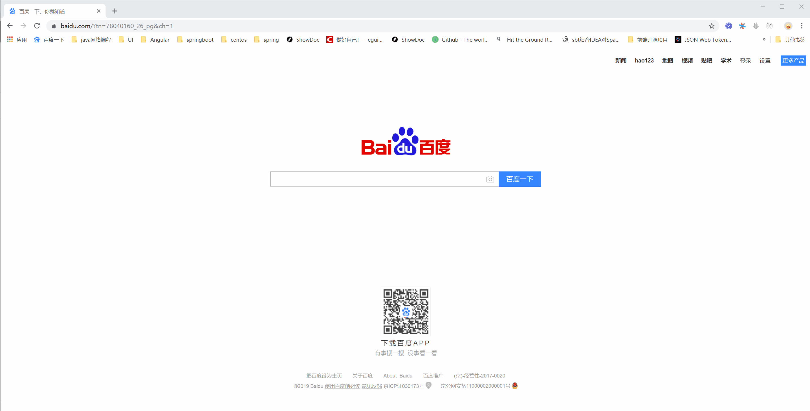

上篇 [Spring boot+Security OAuth2 爬坑日记（2）项目基础结构](./项目基础结构.MD)

#### 1. 依赖
```xml
<!---------thymeleaf 模板引擎-------->
<dependency>
    <groupId>org.springframework.boot</groupId>
    <artifactId>spring-boot-starter-thymeleaf</artifactId>
</dependency>
```
`thymeleaf` 配置
```yaml
spring:
	thymeleaf:
    	prefix: classpath:/views/
    	suffix: .html
    	cache: false
```
#### 2. 前端页面
自定义登录页面肯定要有自己的页面，先从页面入手，在resources 目录下新建views 目录，在此目录下新建base-login.html 文件如下：
```html
<!DOCTYPE html>
<html xmlns="http://www.w3.org/1999/xhtml" xmlns:th="http://www.thymeleaf.org">
<head th:replace="~{commons/head::header(~{::title},~{::link},~{},~{::script})}">
    <meta charset="UTF-8">
    <title>登录</title>
    <link rel="shortcut icon" href="/statics/favicon.png" type="image/x-icon"/>
    <script src="/statics/libs/now-ui/js/core/jquery.min.js" type="application/javascript"></script>
    <script src="/statics/libs/now-ui/js/core/bootstrap.min.js" type="application/javascript"></script>
    <script src="/statics/libs/now-ui/js/now-ui-kit.js" type="application/javascript"></script>
    <script src="/statics/libs/layer/layer.js" type="application/javascript"></script>
    <link rel="stylesheet" href="/statics/styles/base-login.css"/>
</head>
<body>
<br><br><br>
<div class="container">
    <div class="card-container">
        <div class="card">
            <div class="car-header">
                <h2 class="header-title">
                    <span class="name">OAUTH</span>
                    <span class="separator">·</span>
                    <span class="type">BOOT</span>
                </h2>
                <ul class="nav nav-tabs  justify-content-center" role="tablist">
                    <li class="nav-item">
                        <a class="nav-link" th:classappend="${type.trim().equalsIgnoreCase('base')
                        ||type.trim().equalsIgnoreCase('')}?'active':''"  href="/auth/login?type=base" >密码登录</a>
                    </li>
                    <li class="nav-item">
                        <a class="nav-link" th:classappend="${type.trim().equalsIgnoreCase('sms')}?'active'" href="/auth/login?type=sms">短信登录</a>
                    </li>
                    <li class="nav-item">
                        <a class="nav-link " th:classappend="${type.trim().equalsIgnoreCase('social')}?'active'" href="/auth/login?type=social" >第三方</a>
                    </li>
                </ul>
            </div>
            <div class="card-body">
                <div class="tab-content">
                    <div class="tab-pane"
                         th:classappend="${type.trim().equalsIgnoreCase('base')
                        ||type.trim().equalsIgnoreCase('')}?'active':''"
                         id="home" role="tabpanel">
                        <div class="content">
                            <form th:action="${base.getLoginProcessUrl()}" method="post">
                                <div class="form-row">
                                    <div class="form-group col">
                                        <div class="input-group">
                                            <div class="input-group-prepend">
                                                <div class="input-group-text">
                                                    <i class="now-ui-icons users_single-02"></i>
                                                </div>
                                            </div>
                                            <input type="text" id="user-name-label" required class="form-control"
                                                   name="username" placeholder="用户名">
                                        </div>

                                    </div>
                                </div>
                                <div class="form-row">
                                    <div class="form-group col">
                                        <div class="input-group">
                                            <div class="input-group-prepend">
                                                <div class="input-group-text">
                                                    <i class="now-ui-icons ui-1_lock-circle-open"></i>
                                                </div>
                                            </div>
                                            <input type="password" id="password-label" required name="password"
                                                   class="form-control" placeholder="密码">
                                        </div>

                                    </div>
                                </div>
                                <div class="form-row">
                                    <div class="form-group col-9">
                                        <div class="input-group">
                                            <div class="input-group-prepend">
                                                <div class="input-group-text">
                                                    <i class="now-ui-icons design_image"></i>
                                                </div>
                                            </div>
                                            <input type="text" required id="code-label" class="form-control"
                                                   placeholder="验证码">
                                        </div>
                                    </div>
                                    <div class="form-group col-3" style="text-align: left">
                                        
                                    </div>
                                </div>
                                <div class="form-row">
                                    <div class="form-group col">
                                        <button type="submit" class="btn btn-primary btn-block">登 录</button>
                                    </div>
                                </div>
                            </form>
                        </div>

                    </div>
                    <div class="tab-pane"
                         th:classappend="${type.trim().equalsIgnoreCase('sms')}?'active'"
                         id="sms" role="tabpanel" >
                        <div class="content">
                            <form th:action="${sms.getLoginProcessUrl()}" method="post">
                                <div class="form-row">
                                    <div class="form-group col">
                                        <div class="input-group">
                                            <div class="input-group-prepend">
                                                <div class="input-group-text">
                                                    <i class="now-ui-icons tech_mobile"> </i>
                                                </div>
                                            </div>
                                            <input type="text" placeholder="手机号" required class="form-control" th:name="${sms.getMobileParameterName()}">
                                        </div>
                                    </div>
                                </div>
                                <div class="form-row">
                                    <div class="form-group col-5">
                                        <div class="input-group">
                                            <div class="input-group-prepend">
                                                <div class="input-group-text">
                                                    <i class="now-ui-icons ui-1_send"></i>
                                                </div>
                                            </div>
                                            <input type="text" th:name="${sms.getCodeParameterName()}"  class="form-control" required name="code" placeholder="验证码">
                                        </div>
                                    </div>
                                    <div class="form-group col-7">
                                            <button type="button" id="sms_code_btn"  class="btn btn-outline-primary">获取验证码</button>
                                    </div>
                                </div>
                                <div class="form-row">
                                    <div class="form-group col">
                                        <button type="submit"  class="btn btn-primary btn-block"> 登 录 </button>
                                    </div>
                                </div>
                            </form>
                        </div>
                    </div>
                    <div class="tab-pane"
                         th:classappend="${type.trim().equalsIgnoreCase('social')}?'active'"
                         id="social" role="tabpanel">
                        social_login （Future）
                    </div>
                </div>
                <div class="footer">
                    OAUTH·BOOT Create By <a href="https://github.com/LookBackInTheRain" target="_blank">@Yuit</a>
                </div>
            </div>
        </div>
    </div>
</div>

<script type="application/javascript">
    loadImageCode();

    function loadImageCode(){
        $.ajax({
            url:'/auth/code?type=picture',
            contentType: 'application/json',
            success:function (item) {
                $("#p_code").attr("src",item.item.value)
            }
        })
    }

    $("#sms_code_btn").click(function () {
        var _slf = $("#sms_code_btn");
        var mobile = $('input[name=mobile]');
        if (!/^1(3|4|5|7|8)\d{9}$/.test(mobile.val())){
            layer.msg("手机号码不正确",{icon:5});
            mobile.focus();
            return;
        }
        $.ajax({
            url:'/auth/code?type=sms&mobile='+mobile.val(),
            contentType: 'application/json',
            success:function (item) {
                var expire = parseInt(item.item.expire)-20;
                var time = setInterval(function () {
                    if (expire > 0 ) {
                        _slf.html("("+(expire--)+")秒")
                        _slf.attr("disabled",true);
                        mobile.attr("readonly",true);
                    }else {
                        _slf.html("获取验证码");
                        _slf.removeAttr("disabled");
                        mobile.removeAttr("readonly");
                        clearInterval(time);
                    }
                },1000);
            }
        })
    });
</script>
</body>
</html>
```

#### 3. Controller
登录页面controller如下
```java
@Controller
public class BaseMainController {
    @Autowired
    private BootSecurityProperties properties;

    @GetMapping("/auth/login")
    public String loginPage(Model model){
        model.addAttribute("loginProcessUrl",properties.getLoginProcessUrl());
        return "base-login";
    }
}
```

#### 4. `WebSecurity` 配置
授权前的用户认证有Security 提供，将自定义的登录页面配置进去
```java
@Configuration
@Order(1)
public class SecurityConfig extends WebSecurityConfigurerAdapter {

    @Autowired
    private BootUserDetailService userDetailService;

    @Autowired
    private BootSecurityProperties properties;

    /**
     * 让Security 忽略这些url，不做拦截处理
     *
     * @param
     * @throws Exception
     */
    @Override
    public void configure(WebSecurity web) throws Exception {
        web.ignoring().antMatchers
                ("/swagger-ui.html/**", "/webjars/**",
                        "/swagger-resources/**", "/v2/api-docs/**",
                        "/swagger-resources/configuration/ui/**", "/swagger-resources/configuration/security/**",
                        "/images/**");
    }

    @Override
    public void configure(AuthenticationManagerBuilder auth) throws Exception {
        auth.userDetailsService(userDetailService);
    }

    @Override
    protected void configure(HttpSecurity http) throws Exception {

        http
                // 必须配置，不然OAuth2的http配置不生效----不明觉厉
                .requestMatchers()
                .antMatchers("/auth/login", properties.getLoginProcessUrl(), "/oauth/authorize")
                .and()
                .authorizeRequests()
                // 自定义页面或处理url是，如果不配置全局允许，浏览器会提示服务器将页面转发多次
                .antMatchers("/auth/login", properties.getLoginProcessUrl())
                .permitAll()
                .anyRequest()
                .authenticated();
        
        // 表单登录
        http.formLogin()
                // 登录页面
                .loginPage("/auth/login")
                // 登录处理url
                .loginProcessingUrl(properties.getLoginProcessUrl());
    }

    @Override
    @Bean
    public AuthenticationManager authenticationManagerBean() throws Exception {
        return super.authenticationManagerBean();
    }

    @Bean
    public PasswordEncoder passwordEncoder() {
        return new BCryptPasswordEncoder();
    }
}
```
到这里已经完成了自定义登录页的功能，接下来继续说自定义授权页面

#### 5. 自定义授权页面
自定义授权页面的方式有两种，分别如下；

（1）.  直接定义如下controller 替换原来的授权controller
```java
@Controller
// 必须配置
@SessionAttributes("authorizationRequest")
public class BootGrantController {

    @RequestMapping("/oauth/confirm_access")
    public ModelAndView getAccessConfirmation(Map<String, Object> model, HttpServletRequest request) throws Exception {
        AuthorizationRequest authorizationRequest = (AuthorizationRequest) model.get("authorizationRequest");
        ModelAndView view = new ModelAndView();
        view.setViewName("base-grant");
        view.addObject("clientId", authorizationRequest.getClientId());
        return view;
    }
}
```
（2）.  在认证服务配置文件中添加如下配置
```java
@Configuration
@EnableAuthorizationServer
public class OAuth2AuthorizationServerConfig extends AuthorizationServerConfigurerAdapter {

	......
	
    @Override
    public void configure(AuthorizationServerEndpointsConfigurer endpoints) throws Exception {
    	......
    	// 最后一个参数为替换之后页面的url
        endpoints.pathMapping("/oauth/confirm_access","/custom/confirm_access");
    }
}
```
之后编写对应的controller实现即可

#### 6. 测试
最终效果如下


下一篇 [Spring boot+Security OAuth2 爬坑日记（4）自定义异常处理 上](https://blog.csdn.net/qq_31063463/article/details/83752459)

#  源码地址 [ Github ](https://github.com/LookBackInTheRain/oauth-boot)
	


