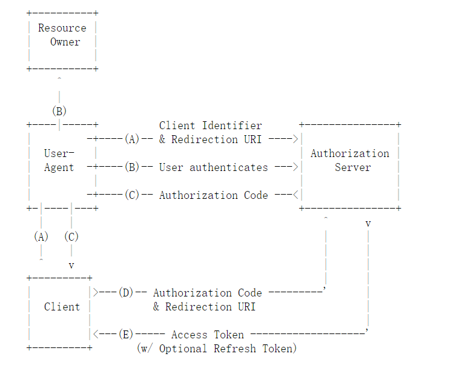
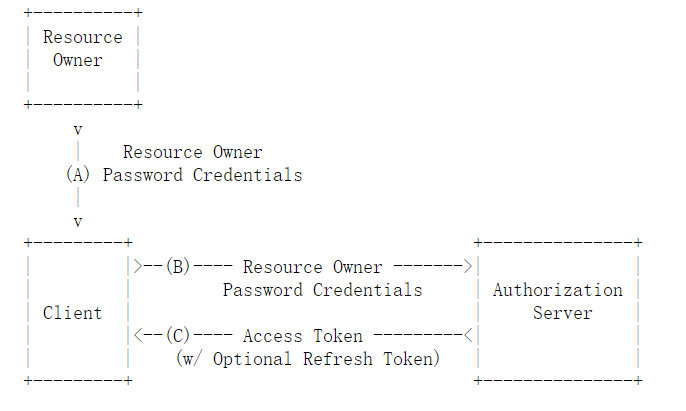
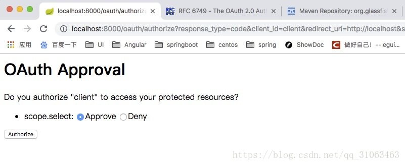
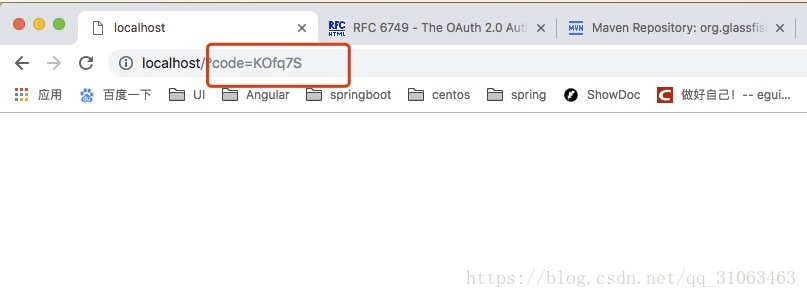
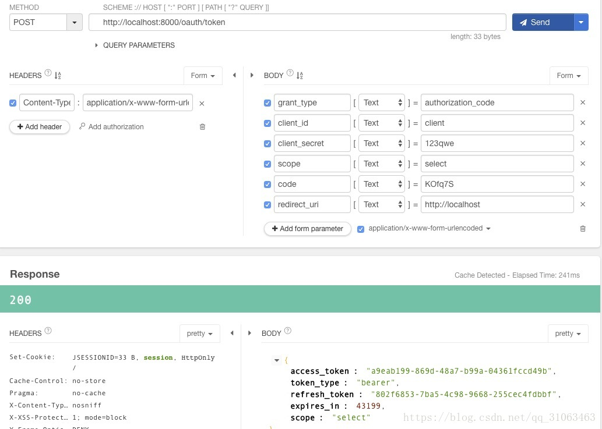
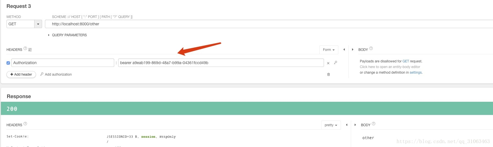
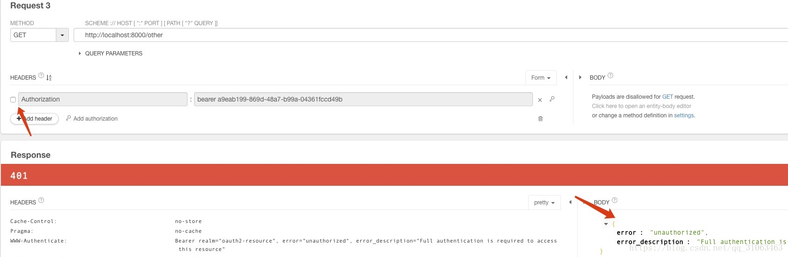

#### OAuth2

OAuth 关于授权的开放网络标准，关于OAuth2的知识，参考[OAuth2.0](https://tools.ietf.org/html/rfc6749) 和 [理解OAuth 2.0-阮一峰](http://www.ruanyifeng.com/blog/2014/05/oauth_2_0.html)

#### 四种授权模式

1. 授权码模式 （功能最完整，流程最严密）
2. 密码模式
3. 客户端模式
4. 简化模式

#### 授权码模式




###  密码模式


#### 开发环境
 系统：Mac / Win10   两个开发环境交替使用  

JDK：java11（Mac），java8（Win10）

IDEA：Intellij IDEA (2018.1-win)，Intellij IDEA (2018.3-mac)

项目管理： maven 3.5

 #### maven 依赖
```xml
<parent>
   <groupId>org.springframework.boot</groupId>
   <artifactId>spring-boot-starter-parent</artifactId>
   <version>2.0.5.RELEASE</version>
   <relativePath/> 
</parent>

<dependencies>
	<dependency>
		<groupId>org.springframework.boot</groupId>
	 	<artifactId>spring-boot-starter-web</artifactId>
	</dependency>
	
	<dependency>
	    <groupId>org.springframework.boot</groupId>
	    <artifactId>spring-boot-starter-security</artifactId>
	</dependency>
	
	<dependency>
	   <groupId>org.springframework.boot</groupId>
	   <artifactId>spring-boot-devtools</artifactId>
	   <scope>runtime</scope>
	</dependency>
	
	<dependency>
	   <groupId>mysql</groupId>
	   <artifactId>mysql-connector-java</artifactId>
	   <scope>runtime</scope>
	</dependency>
	
	<dependency>
	  <groupId>org.projectlombok</groupId>
	  <artifactId>lombok</artifactId>
	  <optional>true</optional>
	</dependency>
	
	<dependency>
	  <groupId>com.baomidou</groupId>
	  <artifactId>mybatis-plus-boot-starter</artifactId>
	  <version>3.0.4</version>
	</dependency>
	
	<dependency>
	   <groupId>com.alibaba</groupId>
	   <artifactId>druid</artifactId>
	   <version>1.1.11</version>
	</dependency>
</dependencies>
```

#### 认证服务配置
```java
@Configuration
@EnableAuthorizationServer
public class OAuth2AuthorizationServerConfig extends AuthorizationServerConfigurerAdapter {

    @Autowired
    private AuthenticationManager authenticationManager;
    
    @Autowired
    private PasswordEncoder passwordEncoder;
    
    @Override
    public void configure(AuthorizationServerSecurityConfigurer security) throws Exception {
       // 允许表单登录
       security.allowFormAuthenticationForClients();
    }

    @Override
    public void configure(ClientDetailsServiceConfigurer clients) throws Exception {

        String secret = passwordEncoder.encode("123qwe");

        clients
        		// 客户端信息存储在内存中
                .inMemory()
                // 客户端 id
                .withClient("client")
                // 跳转uri
                .redirectUris("http://localhost")
                // 客户端 secret 
                .secret(secret)
                // 授权模式
                .authorizedGrantTypes("refresh_token","authorization_code");
    }

    @Override
    public void configure(AuthorizationServerEndpointsConfigurer endpoints) throws Exception {
        endpoints
        		// tonken 存储于内存中
                .tokenStore(new InMemoryTokenStore()) 
                .authenticationManager(authenticationManager);
    }
}
```

#### 资源服务配置

```java
@Configuration
@EnableResourceServer
public class OAuth2ResourceServerConfig  extends  ResourceServerConfigurerAdapter{

    @Override
    public void configure(ResourceServerSecurityConfigurer resources) throws Exception {
        super.configure(resources);
    }

    @Override
    public void configure(HttpSecurity http) throws Exception {
       http
                .authorizeRequests()
                    .anyRequest()
                    .authenticated();
    }
}

```

#### WebSecurity 配置
```java
@Configuration
public class SecurityConfig extends WebSecurityConfigurerAdapter {

    @Autowired
    private BootUserDetailService userDetailService;
    @Autowired
    private BootLoginSuccessHandler bootLoginSuccessHandler;

    /**
     * 让Security 忽略这些url，不做拦截处理
     * @param web
     * @throws Exception
     */
    @Override
    public void configure(WebSecurity web) throws Exception {
        web.ignoring().antMatchers
                ("/swagger-ui.html/**", "/webjars/**",
                        "/swagger-resources/**", "/v2/api-docs/**",
                        "/swagger-resources/configuration/ui/**", "/swagger-resources/configuration/security/**",
                        "/images/**");
    }
    
	@Override
    protected void configure(HttpSecurity http) throws Exception {

        http.formLogin().and()
                .requestMatchers()
                .antMatchers("/login","/oauth/authorize")
                .and()
                .authorizeRequests()
                .anyRequest()
                .authenticated();
    }

    @Override
    protected void configure(AuthenticationManagerBuilder auth) throws Exception {
        auth.userDetailsService(userDetailService);
    }


    @Override
    @Bean
    public AuthenticationManager authenticationManager() throws Exception {
        return super.authenticationManager();
    }

    @Bean
    public PasswordEncoder passwordEncoder() {
        return new BCryptPasswordEncoder();
    }


}
```

#### 自定义 UserDetailsService 

```java
@Component
public class BootUserDetailService implements UserDetailsService {

    @Autowired
    private IUserService userService;

    private Logger logger = LoggerFactory.getLogger(getClass());

    @Override
    public UserDetails loadUserByUsername(String username) throws UsernameNotFoundException {

        User user= this.userService.findByUserName(username);

        GrantedAuthority authority = new SimpleGrantedAuthority("ROLE_USER");

        List <GrantedAuthority>authorities = new ArrayList<>();
        authorities.add(authority);
        user.setAuthorities(authorities);

        if(user==null) {
            throw new UsernameNotFoundException("用户名不存在");
        }

        return user;
    }
}
```


启动系统后在控制台中打印出如下的请求接口
```java

/oauth/authorize   用户确认授权路径

/oauth/token       获取token的路径

```

参考OAuth2.0 官网的文档，请求授权的路径为
```
GET http://localhost:8000/oauth/authorize?response_type=code&client_id=client&redirect_uri=http://localhost&scope=select
```
访问该URL 登录后会出现如下的请求授权的页面


点击（Authorize）确认授权，之后会跳转到预先在请求授权URL中设定的（redirect_uri）的参数值指定的页面并带上授权码，跳转后出现如下页面


得到授权码之后，请求获取Token ，请求参数如下


到这里就获取到了Token，接下来就可以带上Token去请求相关的资源


如果不带上Token，将会有如下错误


-------
[Spring boot+Security OAuth2 爬坑日记（2）授权码模式（升级篇）](https://blog.csdn.net/qq_31063463/article/details/83073739)


>  源码地址 [**Github**](https://github.com/LookBackInTheRain/oauth-boot) 