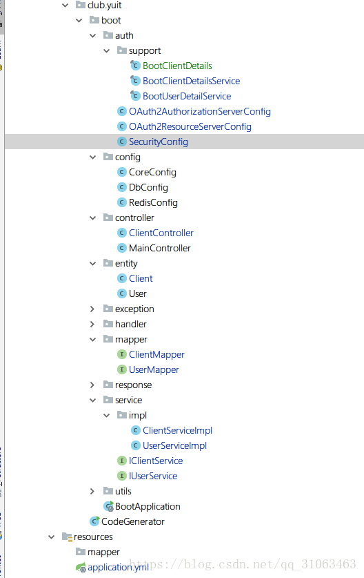
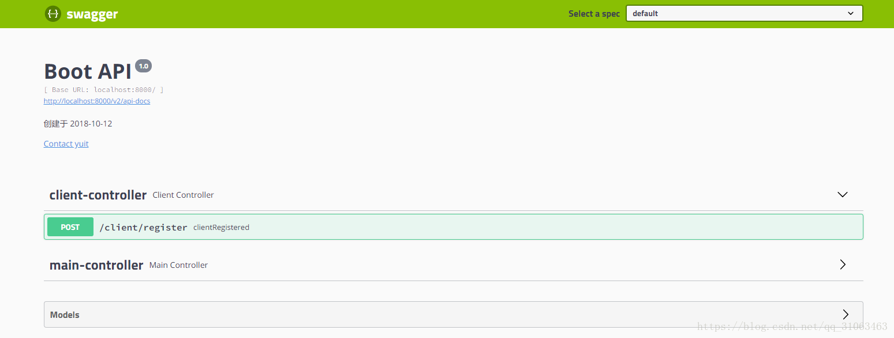
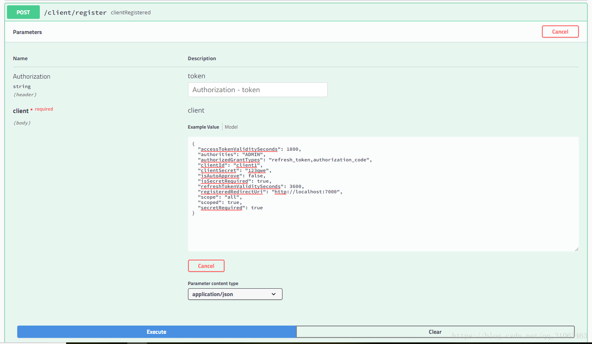

#### 1. 开发环境和本项目用到的框架
接着上一篇[Spring boot+Security OAuth2 爬坑日记（1）授权码模式](https://blog.csdn.net/qq_31063463/article/details/83062232)博客中的内容，上篇介绍了基本的开发环境，系统以及jdk版本等，本篇再来详细介绍下项目中用到的框架和相关类库。

|框架/类库/数据库| 版本号 |
|--|--|
|java|11（Mac）/ 8（Win10）|
| spring-boot | 2.0.5.RELEASE |
|spring-security|5.0.8.RELEASE |
|spring-security-oauth2-autoconfigure|2.0.6.RELEASE|
|mybatis-plus|3.0.4|
|数据库连接池（druid）|1.1.11|
|swagger-ui|2.9.2|
|hibernate-validator|6.0.13.Final|
|MySQL|5.7.22 MySQL Community Server|
|Redis|4.0.10|

通过上述版本发现spring系列的版本都是最新的发布版本，网上示例基本不多，使用必然会出现很多坑；当然有坑之后爬坑才能进步


上篇博客中我们的客户端信息都是保存在内存中的，本篇将客户端信息存储于数据库中；废话不多说，开始撸码！！！！！！！！

#### 2. 项目结构


#### 3. 自定义`BootClientDetailsService`和`BootClientDetails`并配置
新建类 `BootClientDetailsService` 实现`ClientDetailsService` 接口，覆盖`loadClientByClientId(String clientId)`方法，将其声明为spring组件，方便后面配置使用
```java
@Component
public final class BootClientDetailsService implements ClientDetailsService {

    @Autowired
    private IClientService clientService;

    @Override
    public ClientDetails loadClientByClientId(String clientId) throws ClientRegistrationException {

        Client client = this.clientService.findClientByClientId(clientId);

        if(client==null){
            throw new ClientRegistrationException("客户端不存在");
        }

        return new BootClientDetails(client);
    }

}
```

```java
@Data
public final class BootClientDetails implements ClientDetails {

    private Client client;

    public BootClientDetails(Client client) {
        this.client = client;
    }

    public BootClientDetails() {
    }

    @Override
    public String getClientId() {
        return client.getClientId();
    }

    @Override
    public Set<String> getResourceIds() {
        return client.getResourceIds()!=null?
                transformStringToSet(client.getResourceIds(),String.class):null;
    }

    @Override
    public boolean isSecretRequired() {
        return client.getIsSecretRequired();
    }

    @Override
    public String getClientSecret() {
        return client.getClientSecret();
    }

    @Override
    public boolean isScoped() {
        return client.getIsScoped();
    }

    @Override
    public Set<String> getScope() {
        return client.getScope()!=null?
                transformStringToSet(client.getScope(),String.class):null;
    }

    @Override
    public Set<String> getAuthorizedGrantTypes() {
        return client.getAuthorizedGrantTypes()!=null?
                transformStringToSet(client.getAuthorizedGrantTypes(),String.class):null;
    }

    @Override
    public Set<String> getRegisteredRedirectUri() {
        return client.getRegisteredRedirectUri()!=null?
                transformStringToSet(client.getRegisteredRedirectUri(),String.class):null;
    }

    @Override
    public Collection<GrantedAuthority> getAuthorities() {
        return (client.getAuthorities()!=null&&client.getAuthorities().trim().length()>0)?
                AuthorityUtils.commaSeparatedStringToAuthorityList(client.getAuthorities()):null;
    }

    @Override
    public Integer getAccessTokenValiditySeconds() {
        return client.getAccessTokenValiditySeconds();
    }

    @Override
    public Integer getRefreshTokenValiditySeconds() {
        return client.getRefreshTokenValiditySeconds();
    }

    @Override
    public boolean isAutoApprove(String scope) {
        return client.getIsAutoApprove();
    }

    @Override
    public Map<String, Object> getAdditionalInformation() {
        return null;
    }
}
```

将我们定义的	`BootClientDetailsService`配置在`OAuth2AuthorizationServerConfig`中

```java
@Configuration
@EnableAuthorizationServer
public class OAuth2AuthorizationServerConfig extends AuthorizationServerConfigurerAdapter {

    @Autowired
    private AuthenticationManager authenticationManager;

    @Autowired
    private PasswordEncoder passwordEncoder;

    @Autowired
    private BootClientDetailsService clientDetailsService;


    @Override
    public void configure(AuthorizationServerSecurityConfigurer security) throws Exception {
        // 允许表单登录
       security.allowFormAuthenticationForClients();
    }

    @Override
    public void configure(ClientDetailsServiceConfigurer clients) throws Exception {

       // String secret = passwordEncoder.encode("123qwe");

        clients.withClientDetails(clientDetailsService);
                /*// 客户端存储信息存储于内存中
                .inMemory()
                // 客户端名称
                .withClient("client")
                // 跳转uri,可配置多个
                .redirectUris("http://localhost")
                // 权限
               // .authorities("ROLE_USER")
                // 客户端 secret
                .secret(secret)
                // 授权模式
                .authorizedGrantTypes("refresh_token","authorization_code");*/
    }

    @Override
    public void configure(AuthorizationServerEndpointsConfigurer endpoints) throws Exception {
        endpoints
                .tokenStore(new InMemoryTokenStore())
                .authenticationManager(authenticationManager);
    }
}
```
#### 4. 创建注册客户端的接口`ClientController`
```java

@RestController
@RequestMapping("client")
public class ClientController {

    @Autowired
    private IClientService clientService;

    @Autowired
    private PasswordEncoder passwordEncoder;

    @PostMapping("/register")
    public BaseResponse clientRegistered(@RequestBody @Valid Client client){
		client.setClientSecret(passwordEncoder.encode(client.getClientSecret()));
        boolean i = clientService.save(client);
        return HttpResponse.baseResponse(200);
    }

}

```
`WebSecurityConfig` 配置 如下
```java
@Configuration
public class SecurityConfig extends WebSecurityConfigurerAdapter {

    @Autowired
    private BootUserDetailService userDetailService;


    /**
     * 让Security 忽略这些url，不做拦截处理
     * @param
     * @throws Exception
     */
    @Override
    public void configure(WebSecurity web) throws Exception {
        web.ignoring().antMatchers
                ("/swagger-ui.html/**", "/webjars/**",
                        "/swagger-resources/**", "/v2/api-docs/**",
                        "/swagger-resources/configuration/ui/**", "/swagger-resources/configuration/security/**",
                        "/images/**");
    }

    @Override
    public void configure(AuthenticationManagerBuilder auth) throws Exception {
        auth.userDetailsService(userDetailService);
    }

    @Override
    protected void configure(HttpSecurity http) throws Exception {

        http.formLogin().and()
                .requestMatchers()
                .antMatchers("/login","/oauth/**")
                .and()
                .authorizeRequests()
                .anyRequest()
                .authenticated();
    }

    @Override
    @Bean
    public AuthenticationManager authenticationManagerBean() throws Exception {
        return super.authenticationManagerBean();
    }

    @Bean
    public PasswordEncoder passwordEncoder() {
        return new BCryptPasswordEncoder();
    }


}
```
`ResourcesServerConfig` 配置
```java
@Configuration
@EnableResourceServer
public class OAuth2ResourceServerConfig  extends ResourceServerConfigurerAdapter{
    @Override
    public void configure(HttpSecurity http) throws Exception {
        http
                .authorizeRequests()
                    .anyRequest()
                    .authenticated();
        //http.sessionManagement().sessionCreationPolicy(SessionCreationPolicy.IF_REQUIRED);
    }
}
```
#### 5. 测试
项目中已经集成好了swagger-ui，项目启动后直接访问http://localhost:8000/swagger-ui.html，出现如下页面


通过swagger-ui注册客户端，请求参数如下



```json
{
  "accessTokenValiditySeconds": 1800,
  "authorities": "ADMIN",
  "authorizedGrantTypes": "refresh_token,authorization_code",
  "clientId": "client1",
  "clientSecret": "123qwe",
  "isAutoApprove": false,
  "isSecretRequired": true,
  "refreshTokenValiditySeconds": 3600,
  "registeredRedirectUri": "http://localhost:7000",
  "scope": "all",
  "scoped": true,
  "secretRequired": true
}
```
客户端注册成功后就可以使用该客户端的信息申请授权，申请授权的步骤和[Spring boot+Security OAuth2 爬坑日记（1）授权码模式](https://blog.csdn.net/qq_31063463/article/details/83062232)中的一样，这里不再赘述

下一篇 [Spring boot+Security OAuth2 爬坑日记（3）自定义登录和授权页面](https://blog.csdn.net/qq_31063463/article/details/83657151)

---

>  源码地址 [ **Github** ](https://github.com/LookBackInTheRain/oauth-boot)   