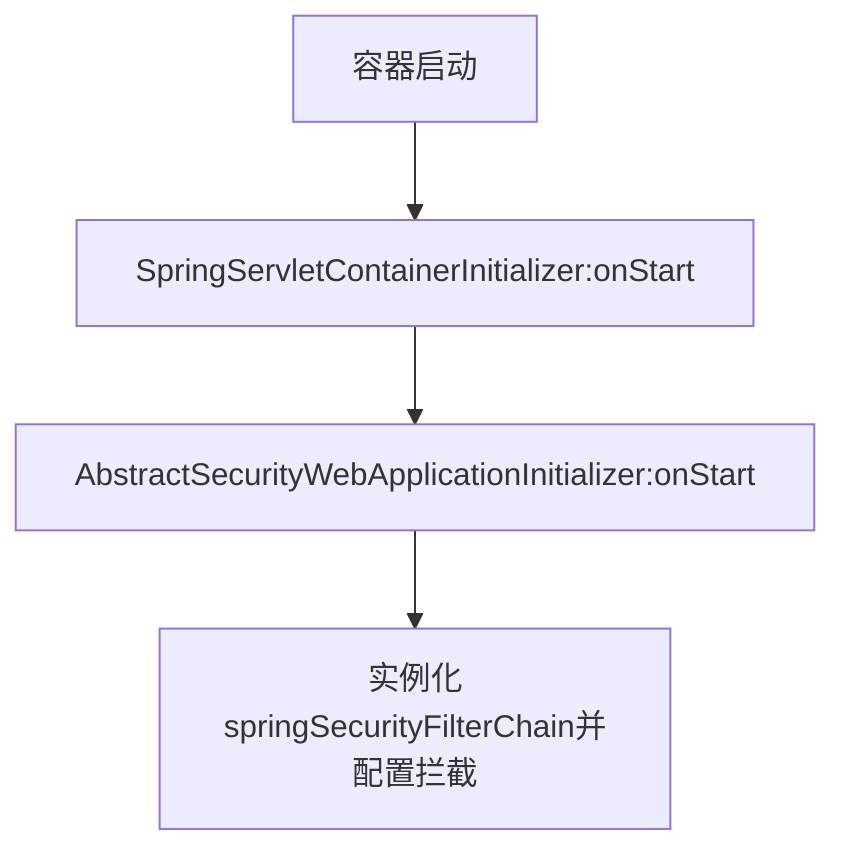
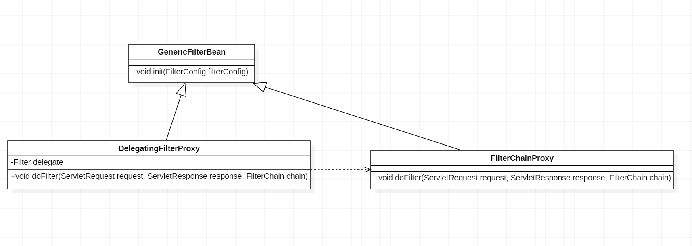

# 带入问题
1. Spring Security 的过滤器链何时被创建，创建方式等
2. 过滤器链中的重要各个过滤器功能
3. 分析传统 Spring WAR（java base config） 构建方式与Spring Boot JAR构建方式过滤器链的创建方式

# 传统 WAR 构建方式过滤器链的创建
过滤器创建需要提到 `@HandlesTypes`  注解和 `ServletContainerInitializer` 接口；Servlet 规范中指出容器启动时通过jar中META-INF/services/javax.servlet.ServletContainerInitializer文件中的规定的并实现`ServletContainerInitializer` 接口的类，通过反射机制实例化这些类并调用onStart(Set\<Class\> cls,ServletContext sc)方法;通常这些类会被`@HandlesTypes` 修饰，在实例化这些类的同时查找`@HandlesTypes` 参数规定的类，将其作为参数传到onStart方法中。这里只是了解下`@HandlesTypes` 和 `ServletContainerInitializer` 的用法，需要了解更多的可以参考 [Servlet 4.0规范 官方文档](https://download.oracle.com/otndocs/jcp/servlet-4-final-eval-spec/index.html)

创建一个ServletContainerInitializer 实现类如下;
```java
@HandlesTypes(BootAppInitializer.class)
public class BootAppServletContainerInitializer implements ServletContainerInitializer {

    private Logger logger = LoggerFactory.getLogger(BootAppServletContainerInitializer.class);

    @Override
    public void onStartup(Set<Class<?>> cls, ServletContext ctx) throws ServletException {
            logger.info("BootAppInit-->onStart()");
            // 没有找到BootAppInitializer相关的类，接口时该参数为null
            if (cls==null ){
                return;
            }
            List<BootAppInitializer> initializers = new LinkedList<>();
            for (Class cs:cls){
                // 不是接口或抽象类
                if (!cs.isInterface()&&!Modifier.isAbstract(cs.getModifiers())){
                    try {
                        initializers.add((BootAppInitializer)cs.newInstance());
                    }catch (Throwable ex){
                        logger.error(ex.getMessage());
                    }

                }
            }

            if(initializers.isEmpty()){
                logger.warn("No BootAppInitializer");
            }
            // 调用onStart方法
            for (BootAppInitializer initializer:initializers){
                initializer.onStart(ctx);
            }

    }

}
```

在Spring中`WebApplicationInitializer`为`ServletContainerInitializer`的实现类，并在`SpringServletContainerInitializer`上使用了`@HandlesTypes`注解，指定收集`WebApplicationInitializer`的子类，其中`AbstractSecurityWebApplicationInitializer` 为其子类；SpringServletContainerInitializer:onStart()方法核心代码如下

```java
@Override
public void onStartup(@Nullable Set<Class<?>> webAppInitializerClasses, ServletContext servletContext)
			throws ServletException {

		List<WebApplicationInitializer> initializers = new LinkedList<>();

		if (webAppInitializerClasses != null) {
			for (Class<?> waiClass : webAppInitializerClasses) {
				/* 判断是否为接口或抽象类 不是则收集，在集成Security 时要自己写一个非抽象类实现
                 * AbstractSecurityWebApplicationInitializer抽象类，最后收集的就是自己写的非抽象的实现类
				**/
                if (!waiClass.isInterface() && !Modifier.isAbstract(waiClass.getModifiers()) &&
						WebApplicationInitializer.class.isAssignableFrom(waiClass)) {
					try {
						initializers.add((WebApplicationInitializer)
								ReflectionUtils.accessibleConstructor(waiClass).newInstance());
					}
					catch (Throwable ex) {
						throw new ServletException("Failed to instantiate WebApplicationInitializer class", ex);
					}
				}
			}
		}

        .........
        // 循环调用收集到 {WebApplicationInitializer} 子类的onStart()方法
		for (WebApplicationInitializer initializer : initializers) {
			initializer.onStartup(servletContext);
		}
	}
```



具体过滤器链的配置与实例化的核心代码如下,以下代码删除了部分代码保留了创建springSecurityFilterChain的核心代码，主要看中文注释部分即可，入口在onStart方法
```java
public abstract class AbstractSecurityWebApplicationInitializer
		implements WebApplicationInitializer {

	......

	public static final String DEFAULT_FILTER_NAME = "springSecurityFilterChain";

	
	public final void onStartup(ServletContext servletContext) throws ServletException {
		......
        beforeSpringSecurityFilterChain(servletContext);

        // 调用insertSpringSecurityFilterChain()创建
		insertSpringSecurityFilterChain(servletContext);
		
        afterSpringSecurityFilterChain(servletContext);
	}

	// 实例化Filter
	private void insertSpringSecurityFilterChain(ServletContext servletContext) {
		String filterName = DEFAULT_FILTER_NAME;
        // 实例化
		DelegatingFilterProxy springSecurityFilterChain = new DelegatingFilterProxy(
				filterName);
		String contextAttribute = getWebApplicationContextAttribute();
		if (contextAttribute != null) {
			springSecurityFilterChain.setContextAttribute(contextAttribute);
		}
		registerFilter(servletContext, true, filterName, springSecurityFilterChain);
	}

	
	// 配置FIlter的信息，
	private final void registerFilter(ServletContext servletContext,
			boolean insertBeforeOtherFilters, String filterName, Filter filter) {
        // 添加到 ServletContext，（让Filter生效）
		Dynamic registration = servletContext.addFilter(filterName, filter);
		if (registration == null) {
			throw new IllegalStateException(
					"Duplicate Filter registration for '" + filterName
							+ "'. Check to ensure the Filter is only configured once.");
		}
		registration.setAsyncSupported(isAsyncSecuritySupported());
        /* dispatcherTypes getSecurityDispatcherTypes(){EnumSet.of(DispatcherType.REQUEST, DispatcherType.ERROR,
				DispatcherType.ASYNC)}
        */
		EnumSet<DispatcherType> dispatcherTypes = getSecurityDispatcherTypes();
        // 拦截的url （/*）
		registration.addMappingForUrlPatterns(dispatcherTypes, !insertBeforeOtherFilters,
				"/*");
	}
	
}

```
在onStart() 中 调用insertSpringSecurityFilterChain方法实例化 Filter ，之后调用registerFilter方法 配置Filter并添加到ServletContext中。`ServletContext` 初始化完成后，`ContextLoaderListener` 登场该类实现了`ServletContextListener`和继承了`ContextLoader`并覆盖了`contextInitialized()`方法，此方法会在`ServletContext` 初始完成后执行，具体方法如下，这个方法的具体方法`initWebApplicationContext()`实现在`ContextLoader` 中，这个方法完成了`XmlWebApplicationContext` 的初始化（bean收集等）在这个地方执行实际拦截处理逻辑的`FilterChainProxy` 已配置完成。
```java
    @Override
	public void contextInitialized(ServletContextEvent event) {
		// 初始化XmlWebApplicationContext 并放入ServletContext 中
		initWebApplicationContext(event.getServletContext());
	}
```
这个方法执行完后成后便是各种`Filter`,`HttpServlet`,`ServletRequestListener` 等的初始化方法的调用，到这里`DelegatingFilterProxy` 的init()方法也会执行，该方法会调用`initFilterBean()` 方法，最终`DelegatingFilterProxy`中的成员Filter (变量名:delegate) 被赋值，（从`XmlWebApplicationContext` 取出）


```java
public class DelegatingFilterProxy extends GenericFilterBean {

	@Nullable
	private volatile Filter delegate;
	....
	@Override
	protected void initFilterBean() throws ServletException {
		synchronized (this.delegateMonitor) {
			if (this.delegate == null) {
				// If no target bean name specified, use filter name.
				if (this.targetBeanName == null) {
					this.targetBeanName = getFilterName();
				}
				// Fetch Spring root application context and initialize the delegate early,
				// if possible. If the root application context will be started after this
				// filter proxy, we'll have to resort to lazy initialization.
				WebApplicationContext wac = findWebApplicationContext();
				if (wac != null) {
					this.delegate = initDelegate(wac);
				}
			}
		}
	}

	@Override
	public void doFilter(ServletRequest request, ServletResponse response, FilterChain filterChain)
			throws ServletException, IOException {

		// Lazily initialize the delegate if necessary.
		Filter delegateToUse = this.delegate;
		if (delegateToUse == null) {
			synchronized (this.delegateMonitor) {
				delegateToUse = this.delegate;
				if (delegateToUse == null) {
					WebApplicationContext wac = findWebApplicationContext();
					if (wac == null) {
						throw new IllegalStateException("No WebApplicationContext found: " +
								"no ContextLoaderListener or DispatcherServlet registered?");
					}
					delegateToUse = initDelegate(wac);
				}
				this.delegate = delegateToUse;
			}
		}

		// Let the delegate perform the actual doFilter operation.
		invokeDelegate(delegateToUse, request, response, filterChain);
	}


	@Nullable
	protected WebApplicationContext findWebApplicationContext() {
		if (this.webApplicationContext != null) {
			// The user has injected a context at construction time -> use it...
			if (this.webApplicationContext instanceof ConfigurableApplicationContext) {
				ConfigurableApplicationContext cac = (ConfigurableApplicationContext) this.webApplicationContext;
				if (!cac.isActive()) {
					// The context has not yet been refreshed -> do so before returning it...
					cac.refresh();
				}
			}
			return this.webApplicationContext;
		}
		String attrName = getContextAttribute();
		if (attrName != null) {
			return WebApplicationContextUtils.getWebApplicationContext(getServletContext(), attrName);
		}
		else {
			return WebApplicationContextUtils.findWebApplicationContext(getServletContext());
		}
	}

	
	protected Filter initDelegate(WebApplicationContext wac) throws ServletException {
		String targetBeanName = getTargetBeanName();
		Assert.state(targetBeanName != null, "No target bean name set");
		Filter delegate = wac.getBean(targetBeanName, Filter.class);
		if (isTargetFilterLifecycle()) {
			delegate.init(getFilterConfig());
		}
		return delegate;
	}


	protected void invokeDelegate(
			Filter delegate, ServletRequest request, ServletResponse response, FilterChain filterChain)
			throws ServletException, IOException {

		delegate.doFilter(request, response, filterChain);
	}
}
```
从上述的类图和`DelegatingFilterProxy` 的部分代码可以看出，执行最终逻辑的Filter为`FilterChainProxy`，过滤器链已经初始化完成。接下来分析下Spring Boot 的`DelegatingFilterProxy` 初始化过程

# Spring Boot 过滤器链初始化

在 Spring Boot 中 `DelegatingFilterProxy` 初始化在`SecurityFilterAutoConfiguration` 类中完成初始化

