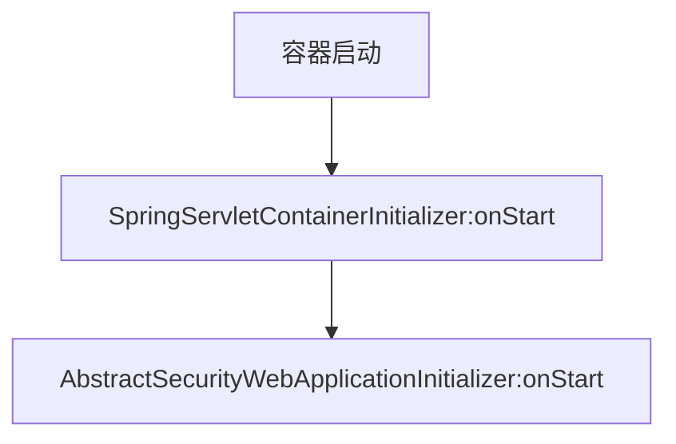

# 带入问题
1. Spring Security 的过滤器链何时被创建，创建方式等
2. 过滤器链中的重要各个过滤器功能

# 过滤器的链创建
过滤器创建需要提到 `@HandlesTypes`  注解和 `ServletContainerInitializer` 接口；Servlet 规范中指出容器启动时通过jar中META-INF/services/javax.servlet.ServletContainerInitializer文件中的规定的并实现`ServletContainerInitializer` 接口的类，通过反射机制实例化这些类并调用onStart(Set\<Class\> cls,ServletContext sc)方法;通常这些类会被`@HandlesTypes` 修饰，在实例化这些类的同时查找`@HandlesTypes` 参数规定的类，将其作为参数传到onStart方法中。这里只是了解下`@HandlesTypes` 和 `ServletContainerInitializer` 的用法，需要了解更多的可以参考 [Servlet 4.0规范 官方文档](https://download.oracle.com/otndocs/jcp/servlet-4-final-eval-spec/index.html)

创建一个ServletContainerInitializer 实现类如下;
```java
@HandlesTypes(BootAppInitializer.class)
public class BootAppServletContainerInitializer implements ServletContainerInitializer {

    private Logger logger = LoggerFactory.getLogger(BootAppServletContainerInitializer.class);

    @Override
    public void onStartup(Set<Class<?>> cls, ServletContext ctx) throws ServletException {
            logger.info("BootAppInit-->onStart()");
            // 没有找到BootAppInitializer相关的类，接口时该参数为null
            if (cls==null ){
                return;
            }
            List<BootAppInitializer> initializers = new LinkedList<>();
            for (Class cs:cls){
                // 不是接口或抽象类
                if (!cs.isInterface()&&!Modifier.isAbstract(cs.getModifiers())){
                    try {
                        initializers.add((BootAppInitializer)cs.newInstance());
                    }catch (Throwable ex){
                        logger.error(ex.getMessage());
                    }

                }
            }

            if(initializers.isEmpty()){
                logger.warn("No BootAppInitializer");
            }
            // 调用onStart方法
            for (BootAppInitializer initializer:initializers){
                initializer.onStart(ctx);
            }

    }

}
```

