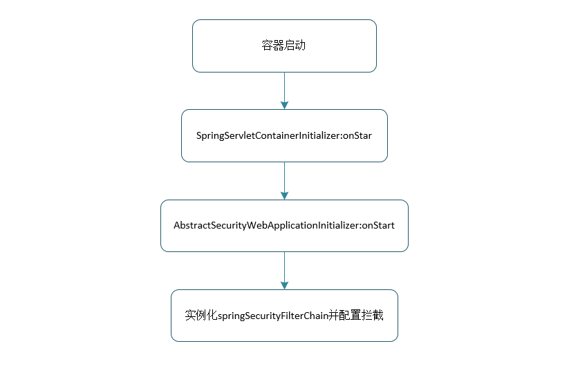
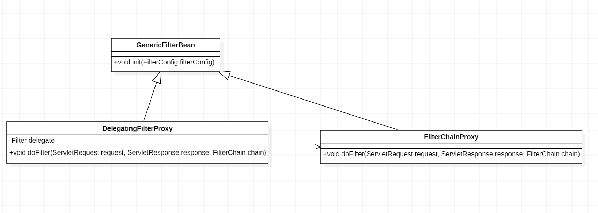
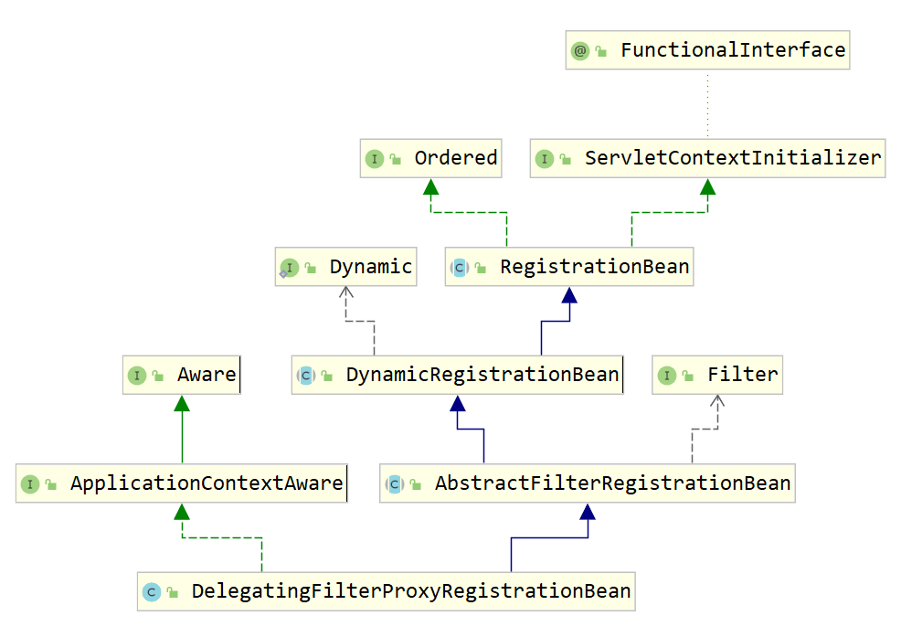
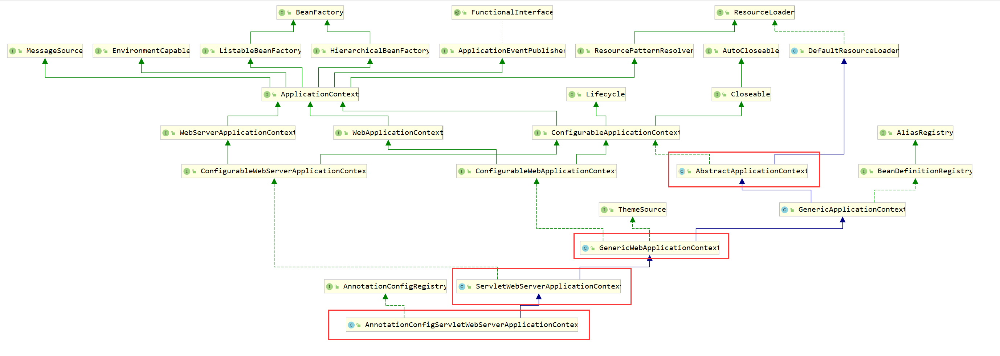
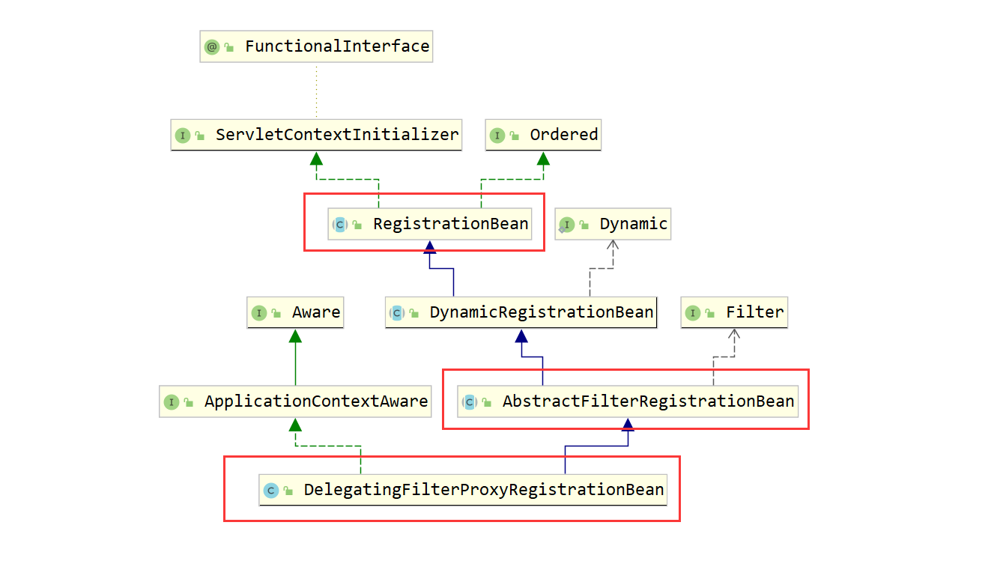

# Spring Security 
`DelegatingFilterProxy` 初始化
# 带入问题
1. Spring Security 的过滤器链何时被创建，创建方式等
2. 过滤器链中的重要各个过滤器功能
3. 分析传统 Spring WAR（java base config） 构建方式与Spring Boot JAR构建方式过滤器链的创建方式

# DelegatingFilterProxy
`DelegatingFilterProxy` 是整个Spring Security 过滤器链的入口，是 `FilterChainProxy` 的代理。

# 传统 WAR 构建部署方式`DelegatingFilterProxy`的初始化
过滤器创建需要提到 `@HandlesTypes`  注解和 `ServletContainerInitializer` 接口；Servlet 规范中指出容器启动时通过jar中META-INF/services/javax.servlet.ServletContainerInitializer文件中的规定的并实现`ServletContainerInitializer` 接口的类，通过反射机制实例化这些类并调用onStart(Set\<Class\> cls,ServletContext sc)方法;通常这些类会被`@HandlesTypes` 修饰，在实例化这些类的同时查找`@HandlesTypes` 参数规定的类，将其作为参数传到onStart方法中。这里只是了解下`@HandlesTypes` 和 `ServletContainerInitializer` 的用法，需要了解更多的可以参考 [Servlet 4.0规范 官方文档](https://download.oracle.com/otndocs/jcp/servlet-4-final-eval-spec/index.html)

创建一个ServletContainerInitializer 实现类如下;
```java
@HandlesTypes(BootAppInitializer.class)
public class BootAppServletContainerInitializer implements ServletContainerInitializer {

    private Logger logger = LoggerFactory.getLogger(BootAppServletContainerInitializer.class);

    @Override
    public void onStartup(Set<Class<?>> cls, ServletContext ctx) throws ServletException {
            logger.info("BootAppInit-->onStart()");
            // 没有找到BootAppInitializer相关的类，接口时该参数为null
            if (cls==null ){
                return;
            }
            List<BootAppInitializer> initializers = new LinkedList<>();
            for (Class cs:cls){
                // 不是接口或抽象类
                if (!cs.isInterface()&&!Modifier.isAbstract(cs.getModifiers())){
                    try {
                        initializers.add((BootAppInitializer)cs.newInstance());
                    }catch (Throwable ex){
                        logger.error(ex.getMessage());
                    }

                }
            }

            if(initializers.isEmpty()){
                logger.warn("No BootAppInitializer");
            }
            // 调用onStart方法
            for (BootAppInitializer initializer:initializers){
                initializer.onStart(ctx);
            }

    }

}
```

在Spring中`WebApplicationInitializer`为`ServletContainerInitializer`的实现类，并在`SpringServletContainerInitializer`上使用了`@HandlesTypes`注解，指定收集`WebApplicationInitializer`的子类，其中`AbstractSecurityWebApplicationInitializer` 为其子类；SpringServletContainerInitializer:onStart()方法核心代码如下

```java
@Override
public void onStartup(@Nullable Set<Class<?>> webAppInitializerClasses, ServletContext servletContext)
			throws ServletException {

		List<WebApplicationInitializer> initializers = new LinkedList<>();

		if (webAppInitializerClasses != null) {
			for (Class<?> waiClass : webAppInitializerClasses) {
				/* 判断是否为接口或抽象类 不是则收集，在集成Security 时要自己写一个非抽象类实现
                 * AbstractSecurityWebApplicationInitializer抽象类，最后收集的就是自己写的非抽象的实现类
				**/
                if (!waiClass.isInterface() && !Modifier.isAbstract(waiClass.getModifiers()) &&
						WebApplicationInitializer.class.isAssignableFrom(waiClass)) {
					try {
						initializers.add((WebApplicationInitializer)
								ReflectionUtils.accessibleConstructor(waiClass).newInstance());
					}
					catch (Throwable ex) {
						throw new ServletException("Failed to instantiate WebApplicationInitializer class", ex);
					}
				}
			}
		}

        .........
        // 循环调用收集到 {WebApplicationInitializer} 子类的onStart()方法
		for (WebApplicationInitializer initializer : initializers) {
			initializer.onStartup(servletContext);
		}
	}
```



具体过滤器链的配置与实例化的核心代码如下,以下代码删除了部分代码保留了创建springSecurityFilterChain的核心代码，主要看中文注释部分即可，入口在onStart方法
```java
public abstract class AbstractSecurityWebApplicationInitializer
		implements WebApplicationInitializer {

	......

	public static final String DEFAULT_FILTER_NAME = "springSecurityFilterChain";

	
	public final void onStartup(ServletContext servletContext) throws ServletException {
		......
        beforeSpringSecurityFilterChain(servletContext);

        // 调用insertSpringSecurityFilterChain()创建
		insertSpringSecurityFilterChain(servletContext);
		
        afterSpringSecurityFilterChain(servletContext);
	}

	// 实例化Filter
	private void insertSpringSecurityFilterChain(ServletContext servletContext) {
		String filterName = DEFAULT_FILTER_NAME;
        // 实例化
		DelegatingFilterProxy springSecurityFilterChain = new DelegatingFilterProxy(
				filterName);
		String contextAttribute = getWebApplicationContextAttribute();
		if (contextAttribute != null) {
			springSecurityFilterChain.setContextAttribute(contextAttribute);
		}
		registerFilter(servletContext, true, filterName, springSecurityFilterChain);
	}

	
	// 配置FIlter的信息，
	private final void registerFilter(ServletContext servletContext,
			boolean insertBeforeOtherFilters, String filterName, Filter filter) {
        // 添加到 ServletContext，（让Filter生效）
		Dynamic registration = servletContext.addFilter(filterName, filter);
		if (registration == null) {
			throw new IllegalStateException(
					"Duplicate Filter registration for '" + filterName
							+ "'. Check to ensure the Filter is only configured once.");
		}
		registration.setAsyncSupported(isAsyncSecuritySupported());
        /* dispatcherTypes getSecurityDispatcherTypes(){EnumSet.of(DispatcherType.REQUEST, DispatcherType.ERROR,
				DispatcherType.ASYNC)}
        */
		EnumSet<DispatcherType> dispatcherTypes = getSecurityDispatcherTypes();
        // 拦截的url （/*）
		registration.addMappingForUrlPatterns(dispatcherTypes, !insertBeforeOtherFilters,
				"/*");
	}
	
}

```
在onStart() 中 调用insertSpringSecurityFilterChain方法实例化 Filter ，之后调用registerFilter方法 配置Filter并添加到ServletContext中。`ServletContext` 初始化完成后，`ContextLoaderListener` 登场该类实现了`ServletContextListener`和继承了`ContextLoader`并覆盖了`contextInitialized()`方法，此方法会在`ServletContext` 初始完成后执行，具体方法如下，这个方法的具体方法`initWebApplicationContext()`实现在`ContextLoader` 中，这个方法完成了`XmlWebApplicationContext` 的初始化（bean收集等）在这个地方执行实际拦截处理逻辑的`FilterChainProxy` 已配置完成。
```java
    @Override
	public void contextInitialized(ServletContextEvent event) {
		// 初始化XmlWebApplicationContext 并放入ServletContext 中
		initWebApplicationContext(event.getServletContext());
	}
```
这个方法执行完后成后便是各种`Filter`,`HttpServlet`,`ServletRequestListener` 等的初始化方法的调用，到这里`DelegatingFilterProxy` 的init()方法也会执行，该方法会调用`initFilterBean()` 方法，最终`DelegatingFilterProxy`中的成员Filter (变量名:delegate) 被赋值，（从`XmlWebApplicationContext` 取出）


```java
public class DelegatingFilterProxy extends GenericFilterBean {

	@Nullable
	private volatile Filter delegate;
	....
	@Override
	protected void initFilterBean() throws ServletException {
		synchronized (this.delegateMonitor) {
			if (this.delegate == null) {
				// If no target bean name specified, use filter name.
				if (this.targetBeanName == null) {
					this.targetBeanName = getFilterName();
				}
				// Fetch Spring root application context and initialize the delegate early,
				// if possible. If the root application context will be started after this
				// filter proxy, we'll have to resort to lazy initialization.
				WebApplicationContext wac = findWebApplicationContext();
				if (wac != null) {
					this.delegate = initDelegate(wac);
				}
			}
		}
	}

	@Override
	public void doFilter(ServletRequest request, ServletResponse response, FilterChain filterChain)
			throws ServletException, IOException {

		// Lazily initialize the delegate if necessary.
		Filter delegateToUse = this.delegate;
		if (delegateToUse == null) {
			synchronized (this.delegateMonitor) {
				delegateToUse = this.delegate;
				if (delegateToUse == null) {
					WebApplicationContext wac = findWebApplicationContext();
					if (wac == null) {
						throw new IllegalStateException("No WebApplicationContext found: " +
								"no ContextLoaderListener or DispatcherServlet registered?");
					}
					delegateToUse = initDelegate(wac);
				}
				this.delegate = delegateToUse;
			}
		}

		// Let the delegate perform the actual doFilter operation.
		invokeDelegate(delegateToUse, request, response, filterChain);
	}


	@Nullable
	protected WebApplicationContext findWebApplicationContext() {
		if (this.webApplicationContext != null) {
			// The user has injected a context at construction time -> use it...
			if (this.webApplicationContext instanceof ConfigurableApplicationContext) {
				ConfigurableApplicationContext cac = (ConfigurableApplicationContext) this.webApplicationContext;
				if (!cac.isActive()) {
					// The context has not yet been refreshed -> do so before returning it...
					cac.refresh();
				}
			}
			return this.webApplicationContext;
		}
		String attrName = getContextAttribute();
		if (attrName != null) {
			return WebApplicationContextUtils.getWebApplicationContext(getServletContext(), attrName);
		}
		else {
			return WebApplicationContextUtils.findWebApplicationContext(getServletContext());
		}
	}

	
	protected Filter initDelegate(WebApplicationContext wac) throws ServletException {
		String targetBeanName = getTargetBeanName();
		Assert.state(targetBeanName != null, "No target bean name set");
		Filter delegate = wac.getBean(targetBeanName, Filter.class);
		if (isTargetFilterLifecycle()) {
			delegate.init(getFilterConfig());
		}
		return delegate;
	}


	protected void invokeDelegate(
			Filter delegate, ServletRequest request, ServletResponse response, FilterChain filterChain)
			throws ServletException, IOException {

		delegate.doFilter(request, response, filterChain);
	}
}
```
从上述的类图和`DelegatingFilterProxy` 的部分代码可以看出，执行最终逻辑的Filter为`FilterChainProxy`，过滤器链已经初始化完成。接下来分析下Spring Boot 的`DelegatingFilterProxy` 初始化过程

# Spring Boot `DelegatingFilterProxy` 初始化

在 Spring Boot 中 `DelegatingFilterProxy` 初始化在`SecurityFilterAutoConfiguration` 类中完成初始化,在这之前先看一个接口`ServletContextInitializer`关于接口的官方描述如下。
```java
/**
  * Interface used to configure a Servlet 3.0+ context programmatically. 
  * Unlike WebApplicationInitializer, 
  * classes that implement this interface (and do not implement WebApplicationInitializer) will not be detected by SpringServletContainerInitializer and hence will not be automatically bootstrapped by the Servlet container.
*/
@FunctionalInterface
public interface ServletContextInitializer {

	/**
	 * Configure the given {@link ServletContext} with any servlets, filters, listeners
	 * context-params and attributes necessary for initialization.
	 * @param servletContext the {@code ServletContext} to initialize
	 * @throws ServletException if any call against the given {@code ServletContext}
	 * throws a {@code ServletException}
	 */
	void onStartup(ServletContext servletContext) throws ServletException;

}
```
官方注释大概意思就是该接口用于编程的方式配置`ServletContext`，如果有类实现了该接口而没有实现`WebApplicationInitializer`的话就不会被`SpringServletContainerInitializer` 检测到，所以Servlet容器启动时，不会自动调用该实现类的onStart()方法。我们看一下`DelegatingFilterProxyRegistrationBean`类的继承关系，该类间接实现了 `ServletContextInitializer`,该类主要用来初始化配置`DelegatingFilterProxy`。通过源码分析一下`DelegatingFilterProxyRegistrationBean` 什么时候的onStart()方法什么时候被调用，这里只做简单分析，并不会将一行的代码的意义都做分析。这里先埋个坑，日后再做这个系列的文章。


Spring Boot 启动流程的入口为SpringApplication类的run方法，该方法如下（大部分已被省略......）。我们只重点关注流程，不做各个方法功能的具体分析，在这个方法中我们关注的重点是`refreshContext(context)`这个方法的调用，首先该方法在通过调用`createApplicationContext()` 以反射的方式创建并返回 `AnnotationConfigServletWebServerApplicationContext`  的实例，之后便是调用 `refreshContext(context)` 将 `context` 作为参数传入，通过如下源码可以看出在 `SpringAbblication` 这个类中的 `refreshContext(context)` 方法最后会调用 `AbstractApplicationContext` 的`refresh()`方法。

```java

public class SpringApplication {
	......
	public ConfigurableApplicationContext run(String... args) {
		.......
		ConfigurableApplicationContext context = null;
		
		try {
			.......
			// 通过反射的方式创建应用上下文，返回的是 AnnotationConfigServletWebServerApplicationContext 实例
			context = createApplicationContext();
		
			refreshContext(context);
			......
		}
		catch (Throwable ex) {
			.......
		}

		.......
	
		return context;
	}

	private void refreshContext(ConfigurableApplicationContext context) {
		refresh(context);
		if (this.registerShutdownHook) {
			try {
				context.registerShutdownHook();
			}
			catch (AccessControlException ex) {
				// Not allowed in some environments.
			}
		}
	}

	protected void refresh(ApplicationContext applicationContext) {
		Assert.isInstanceOf(AbstractApplicationContext.class, applicationContext);
		((AbstractApplicationContext) applicationContext).refresh();
	}

	.......


}
```
`AnnotationConfigServletWebServerApplicationContext` 的继承关系如下图所示,在下图中重点部分已经用红框标出，接下来我们围绕红框标出的重点类的源码进行分析。



通过上述的分析我们进入了 `AbstractApplicationContext` 的 `refresh()` 方法中，该方法如下（大部分被省略......），和之前的一样我们只关注 `onRefresh()` 方法其他的跳过，该方法实际调用子类`ServletWebServerApplicationContext` 的 `onRefresh()`。
```java
public abstract class AbstractApplicationContext extends DefaultResourceLoader
		implements ConfigurableApplicationContext {
	@Override
	public void refresh() throws BeansException, IllegalStateException {
		synchronized (this.startupShutdownMonitor) {
			......
			try {
				
				// Initialize other special beans in specific context subclasses.
				onRefresh();
				......
				
			}

			catch (BeansException ex) {
				.......
			}

			finally {
				.......
			}
		}
	}
}
```

`ServletWebServerApplicationContext` 的部分源码如下，该方法中调用链 `onRefresh()->createWebServer()->getWebServerFactory()`，这里使用的是Spring Boot默认的内嵌容器tomcat 所以 `getWebServerFactory()` 返回的的实例为 `TomcatServletWebServerFactory`。

```java
public class ServletWebServerApplicationContext extends GenericWebApplicationContext
		implements ConfigurableWebServerApplicationContext {

	@Override
	protected void onRefresh() {
		super.onRefresh();
		try {
			createWebServer();
		}
		catch (Throwable ex) {
			throw new ApplicationContextException("Unable to start web server", ex);
		}
	}

	private void createWebServer() {
		WebServer webServer = this.webServer;
		ServletContext servletContext = getServletContext();
		if (webServer == null && servletContext == null) {
			// 默认Tomcat 返回的实例为 TomcatServletWebServerFactory
			ServletWebServerFactory factory = getWebServerFactory();
			this.webServer = factory.getWebServer(getSelfInitializer());
		}
		else if (servletContext != null) {
			try {
				getSelfInitializer().onStartup(servletContext);
			}
			catch (ServletException ex) {
				throw new ApplicationContextException("Cannot initialize servlet context",
						ex);
			}
		}
		initPropertySources();
	}

	private org.springframework.boot.web.servlet.ServletContextInitializer getSelfInitializer() {
		return this::selfInitialize;
	}

	private void selfInitialize(ServletContext servletContext) throws ServletException {
		prepareWebApplicationContext(servletContext);
		registerApplicationScope(servletContext);
		WebApplicationContextUtils.registerEnvironmentBeans(getBeanFactory(),
				servletContext);
		for (ServletContextInitializer beans : getServletContextInitializerBeans()) {
			beans.onStartup(servletContext);
		}
	}

}
```
通过`ServletWebServerFactory` 的 `getWebServer(ServletContextInitializer... initializers)` 方法获取一个 `WebServer` 实例，该方法传入当前对象的 `getSelfInitializer()` 方法的返回值 `ServletContextInitializer` ；与其对应的方法体为 `selfInitialize(ServletContext servletContext)`，当某个方法中调用了当前实例`ServletContextInitializer` 的`onStart(ServletContext servletContext)` 相当于执行了`selfInitialize(ServletContext servletContext)`这个方法。（这里需要去理解下@FunctionalInterface这个注解的作用及用法）；我们继续跟踪进入`TomcatServletWebServerFactory` 的 `getWebServer(ServletContextInitializer... initializers)` 方法。

```java
public class TomcatServletWebServerFactory extends AbstractServletWebServerFactory
		implements ConfigurableTomcatWebServerFactory, ResourceLoaderAware {

	@Override
	public WebServer getWebServer(ServletContextInitializer... initializers) {
		Tomcat tomcat = new Tomcat();
		File baseDir = (this.baseDirectory != null) ? this.baseDirectory
				: createTempDir("tomcat");
		tomcat.setBaseDir(baseDir.getAbsolutePath());
		Connector connector = new Connector(this.protocol);
		tomcat.getService().addConnector(connector);
		customizeConnector(connector);
		tomcat.setConnector(connector);
		tomcat.getHost().setAutoDeploy(false);
		configureEngine(tomcat.getEngine());
		for (Connector additionalConnector : this.additionalTomcatConnectors) {
			tomcat.getService().addConnector(additionalConnector);
		}
		prepareContext(tomcat.getHost(), initializers);
		return getTomcatWebServer(tomcat);
	}

	protected void prepareContext(Host host, ServletContextInitializer[] initializers) {
		File documentRoot = getValidDocumentRoot();
		TomcatEmbeddedContext context = new TomcatEmbeddedContext();
		......
		ServletContextInitializer[] initializersToUse = mergeInitializers(initializers);
		host.addChild(context);
		configureContext(context, initializersToUse);
		......
	}

	protected void configureContext(Context context,
			ServletContextInitializer[] initializers) {
		TomcatStarter starter = new TomcatStarter(initializers);
		......
		context.addServletContainerInitializer(starter, NO_CLASSES);
		......
	}

}
```
在`getWebServer`方法中创建Tomcat实例并做了一些配置，该方法中的主要调用链 `getWebServer()->prepareContext(tomcat.getHost(), initializers)->configureContext(context, initializersToUse)`，跟踪进入`configureContext(context, initializersToUse)` 方法，其中以`ServletContextInitializer[] initializers` 作为构造参数创建了`TomcatStarter` 实例，并将其添加到Tomcat的声明周期中，在Tomcat 启动时会被调用它的 `onStart(Set<Class<?>> classes,ServletContext context)` 方法，具体的调用在`StandardContext` 的 5139 行左右，我们跟踪进入 `TomcatStarter` 中
```java
class TomcatStarter implements ServletContainerInitializer {
	......
	TomcatStarter(ServletContextInitializer[] initializers) {
		this.initializers = initializers;
	}
	@Override
	public void onStartup(Set<Class<?>> classes, ServletContext servletContext)
			throws ServletException {
		try {
			for (ServletContextInitializer initializer : this.initializers) {
				initializer.onStartup(servletContext);
			}
		}
		catch (Exception ex) {
			this.startUpException = ex;
			// Prevent Tomcat from logging and re-throwing when we know we can
			// deal with it in the main thread, but log for information here.
			if (logger.isErrorEnabled()) {
				logger.error("Error starting Tomcat context. Exception: "
						+ ex.getClass().getName() + ". Message: " + ex.getMessage());
			}
		}
	}

	public Exception getStartUpException() {
		return this.startUpException;
	}

}
```
`TomcatStarter` 类中的实现并不复杂，只是循环执行 `ServletContextInitializer` 的`onStart`方法，其中一个就是`ServletWebServerApplicationContext` 中的 `selfInitialize` 方法，在该方法中就是对`ServletContextInitializer` 的子类进行onStart方法的调用，我们关注的`DelegatingFilterProxyRegistrationBean`就是其中一个子类，到这里我们回到之前的方法调用链`getWebServer()->prepareContext(tomcat.getHost(), initializers)->configureContext(context, initializersToUse)`，分析到这步就是`configureContext(context, initializersToUse)` 执行完成，回到`TomcatServletWebServerFactory` 类的`getWebServer()` 方法中，之后便是调用`getTomcatWebServer(tomcat)` 方法获取一个`WebServer` 实例，我们继续跟踪。（为了方便再把上面的源码在弄一份下来）
```java
public class TomcatServletWebServerFactory extends AbstractServletWebServerFactory
		implements ConfigurableTomcatWebServerFactory, ResourceLoaderAware {

	@Override
	public WebServer getWebServer(ServletContextInitializer... initializers) {
		Tomcat tomcat = new Tomcat();
		......
		prepareContext(tomcat.getHost(), initializers);
		return getTomcatWebServer(tomcat);
	}

	protected void prepareContext(Host host, ServletContextInitializer[] initializers) {
		File documentRoot = getValidDocumentRoot();
		TomcatEmbeddedContext context = new TomcatEmbeddedContext();
		......
		ServletContextInitializer[] initializersToUse = mergeInitializers(initializers);
		host.addChild(context);
		configureContext(context, initializersToUse);
		......
	}

	protected void configureContext(Context context,
			ServletContextInitializer[] initializers) {
		TomcatStarter starter = new TomcatStarter(initializers);
		......
		context.addServletContainerInitializer(starter, NO_CLASSES);
		......
	}
	protected TomcatWebServer getTomcatWebServer(Tomcat tomcat) {
		return new TomcatWebServer(tomcat, getPort() >= 0);
	}
}
```
从上述源码中可以发现`getTomcatWebServer(Tomcat tomcat)` 只是一个简单用 `new` 关键字实例化一个`TomcatWebServer`实例，跟踪进入 `TomcatWebServer` 类
```java
public class TomcatWebServer implements WebServer {
	......
	public TomcatWebServer(Tomcat tomcat, boolean autoStart) {
		Assert.notNull(tomcat, "Tomcat Server must not be null");
		this.tomcat = tomcat;
		this.autoStart = autoStart;
		initialize();
	}
	private void initialize() throws WebServerException {
		logger.info("Tomcat initialized with port(s): " + getPortsDescription(false));
		synchronized (this.monitor) {
			try {
				addInstanceIdToEngineName();

				Context context = findContext();
				context.addLifecycleListener((event) -> {
					if (context.equals(event.getSource())
							&& Lifecycle.START_EVENT.equals(event.getType())) {
						// Remove service connectors so that protocol binding doesn't
						// happen when the service is started.
						removeServiceConnectors();
					}
				});

				// Start the server to trigger initialization listeners
				this.tomcat.start();

				// We can re-throw failure exception directly in the main thread
				rethrowDeferredStartupExceptions();

				try {
					ContextBindings.bindClassLoader(context, context.getNamingToken(),
							getClass().getClassLoader());
				}
				catch (NamingException ex) {
					// Naming is not enabled. Continue
				}
				// Unlike Jetty, all Tomcat threads are daemon threads. We create a
				// blocking non-daemon to stop immediate shutdown
				startDaemonAwaitThread();
			}
			catch (Exception ex) {
				stopSilently();
				throw new WebServerException("Unable to start embedded Tomcat", ex);
			}
		}
	}
}
```
在`TomcatWebServer` 的构造函数中执行了`initialize()` 启动 `Tomcat`。分析到这里`Tomcat` 启动，`TomcatStarter` 的`onStart` 方法会被调用，最终`DelegatingFilterProxyRegistrationBean` 的 `onStart` 也会被调用。接下来我们分析当`DelegatingFilterProxyRegistrationBean` 的onStart调用之后 `DelegatingFilterProxy` 在哪里被实例化。

根据上图红框圈出几个重要的类，`onStart` 方法被定义在 `RegistrationBean` 中，onStart被调用的时候调用定义在`DynamicRegistrationBean` 中的的 `register(String description, ServletContext servletContext)` 方法，在`register` 中调用`addRegistration()->getFilter()` (部分方法参数省略)。在getFilter定义在`DelegatingFilterProxyRegistrationBean` 类中
```java
public class DelegatingFilterProxyRegistrationBean
		extends AbstractFilterRegistrationBean<DelegatingFilterProxy>
		implements ApplicationContextAware {
	......
	@Override
	public DelegatingFilterProxy getFilter() {
		return new DelegatingFilterProxy(this.targetBeanName,
				getWebApplicationContext()) {

			@Override
			protected void initFilterBean() throws ServletException {
				// Don't initialize filter bean on init()
			}

		};
	}
	......
}
```
`getFilter()` 方法直接`new` 创建并返回`DelegatingFilterProxy` 之后就是各种配置这里就不在赘述，分析到这里`DelegatingFilterProxy` 已经被实例并配置到 `ServletContext` 中。

# 总结
1. 本篇讲述了`DelegatingFilterProxy`作用。
2. 从两个角度（传统web.xml方式开发war部署和Spring Boot）分析了 `DelegatingFilterProxy` 的初始化过程。
3. 在Spring Boot 中还从源码的角度细致的进行跟踪，简单了解Spring Boot的启动流程。