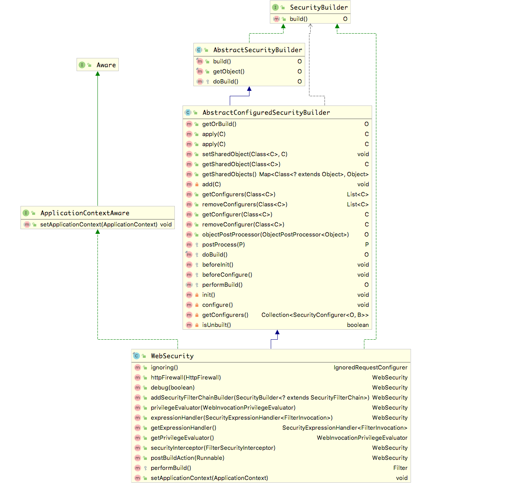
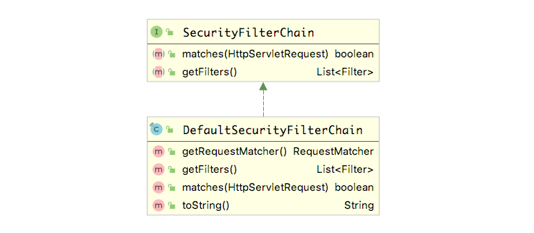
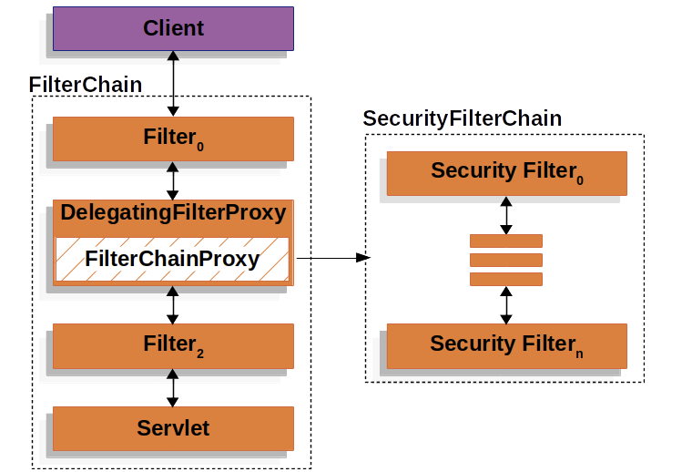

# Spring Security  `FilterChainProxy` 的初始化 
在上篇 [SpringSecurity如何工作](./SpringSecurity如何工作-1.MD) 中分析了`DelegatingFilterProxy` 的初始化过程，并知道了`DelegatingFilterProxy`只是整个过滤器链的开端。
具体的执行逻辑在 `FilterChainProxy` 中。在本篇中着重分析`FilterChainProxy` 的初始化过程。与上篇一样我们分两个方向（Spring 和 Spring Boot）去做解读。

# 带入问题
1. `FilterChainProxy` 作用
2. `FilterChainProxy` 创建过程

# `FilterChianProxy` 
```
Delegates {@code Filter} requests to a list of Spring-managed filter beans  
// 把请求委托给Spring 管理的filter列表，这些filter 包括 UsernamePasswordAuthenticationFilter,LogoutFilter 等
```

# 了解 `@EnableWebSecurity` 注解

要开启Spring Security 不光要继承 `AbstractSecurityWebApplicationInitializer` 类，还要在配置类中使用`@EnableWebSecurity` 注解开启Spring Security 配置，这个注解导入了三个配置类分别为`WebSecurityConfiguration`、`SpringWebMvcImportSelector`、`OAuth2ImportSelector`，同时该注解还被`@EnableGlobalAuthentication`修饰；我们先了解下导入的三个配置类和`@EnableGlobalAuthentication`的作用
#### 1. `WebSecurityConfiguration`
对`WebSecurity`相关的配置进行初始化，包括 `FilterChainProxy`
#### 2. `SpringWebMvcImportSelector`
用于导入 `WebMvcSecurityConfiguration` 配置类
#### 3. `OAuth2ImportSelector`
用于导入 `OAuth2ClientConfiguration` 配置类。

#### 4. `@EnableGlobalAuthentication` 
该注解导入了`AuthenticationConfiguration`和`ObjectPostProcessorConfiguration`配置类,这些类的主要的配置在下面的文章中再做分析

#  Spring  项目 `FilterChainProxy` 的初始化
`FilterChainProxy` 的初始化在 `WebSecurityConfiguration` 类中，该配置类的部分源代码如下，首先执行的是`setFilterChainProxySecurityConfigurer` 方法,之后就是各种@Bean修饰的方法的执行；重点看`springSecurityFilterChain` 方法，具体的分析看注释
```java
@Configuration
public class WebSecurityConfiguration implements ImportAware, BeanClassLoaderAware {
	private WebSecurity webSecurity;
	private Boolean debugEnabled;
	private List<SecurityConfigurer<Filter, WebSecurity>> webSecurityConfigurers;
	private ClassLoader beanClassLoader;
	@Autowired(required = false)
	private ObjectPostProcessor<Object> objectObjectPostProcessor;
	/**
	 * Creates the Spring Security Filter Chain
	 * @return the {@link Filter} that represents the security filter chain
	 * @throws Exception
     * 该方法执行晚于 setFilterChainProxySecurityConfigurer 
	 */
	@Bean(name = AbstractSecurityWebApplicationInitializer.DEFAULT_FILTER_NAME)
	public Filter springSecurityFilterChain() throws Exception {
        // 执行过 setFilterChainProxySecurityConfigurer 方法后是否收集到配置类
		boolean hasConfigurers = webSecurityConfigurers != null
				&& !webSecurityConfigurers.isEmpty();
        // T4 没有收集到配置类直接使用new 关键之创建一个setFilterChainProxySecurityConfigurer 类并将其加入到IOC的管理中
		if (!hasConfigurers) {
			WebSecurityConfigurerAdapter adapter = objectObjectPostProcessor
					.postProcess(new WebSecurityConfigurerAdapter() {
					});
			webSecurity.apply(adapter);
		}
        // T5 执行WebSecurity 的build方法
		return webSecurity.build();
	}

    /**
    * 初始化配置 WebSecurity，将其加入到IOC容器中
    */
	@Autowired(required = false)
	public void setFilterChainProxySecurityConfigurer(
			ObjectPostProcessor<Object> objectPostProcessor,
            // T1 在IOC容器中获取SecurityConfigurer的子类，这里获取的是WebSecurityConfigurerAdapter 的子类
			@Value("#{@autowiredWebSecurityConfigurersIgnoreParents.getWebSecurityConfigurers()}") List<SecurityConfigurer<Filter, WebSecurity>> webSecurityConfigurers)
			throws Exception {
            // T2 初始化WebSecurity 并安将其加入到IOC容器的管理中
		webSecurity = objectPostProcessor
				.postProcess(new WebSecurity(objectPostProcessor));
		if (debugEnabled != null) {
			webSecurity.debug(debugEnabled);
		}
        //  对收集的到WebSecurityConfigurerAdapter子类根据@Order注解的值进行排序
		Collections.sort(webSecurityConfigurers, AnnotationAwareOrderComparator.INSTANCE);

		Integer previousOrder = null;
		Object previousConfig = null;
        // 判断收集到的webSecurityConfigurers 中是否存在重复的@Order值存在，重复则抛出异常
		for (SecurityConfigurer<Filter, WebSecurity> config : webSecurityConfigurers) {
			Integer order = AnnotationAwareOrderComparator.lookupOrder(config);
			if (previousOrder != null && previousOrder.equals(order)) {
				throw new IllegalStateException(
						"@Order on WebSecurityConfigurers must be unique. Order of "
								+ order + " was already used on " + previousConfig + ", so it cannot be used on "
								+ config + " too.");
			}
			previousOrder = order;
			previousConfig = config;
		}
        // T3 将收集到的webSecurityConfigurers 循环取出配置类作为参数执行 WebSecurity 的 apply() 方法
		for (SecurityConfigurer<Filter, WebSecurity> webSecurityConfigurer : webSecurityConfigurers) {
			webSecurity.apply(webSecurityConfigurer);
		}
        // 收集到的webSecurityConfigurers 赋值给当前类的webSecurityConfigurers
		this.webSecurityConfigurers = webSecurityConfigurers;
	}

	@Bean
	public static AutowiredWebSecurityConfigurersIgnoreParents autowiredWebSecurityConfigurersIgnoreParents(
			ConfigurableListableBeanFactory beanFactory) {
		return new AutowiredWebSecurityConfigurersIgnoreParents(beanFactory);
	}

	private static class AnnotationAwareOrderComparator extends OrderComparator {
		private static final AnnotationAwareOrderComparator INSTANCE = new AnnotationAwareOrderComparator();
		@Override
		protected int getOrder(Object obj) {
			return lookupOrder(obj);
		}
		private static int lookupOrder(Object obj) {
			if (obj instanceof Ordered) {
				return ((Ordered) obj).getOrder();
			}
			if (obj != null) {
				Class<?> clazz = (obj instanceof Class ? (Class<?>) obj : obj.getClass());
				Order order = AnnotationUtils.findAnnotation(clazz, Order.class);
				if (order != null) {
					return order.value();
				}
			}
			return Ordered.LOWEST_PRECEDENCE;
		}
	}
}
```
分析到这里先放上一张`WebSecurity`的类继承关系图方便后面的分析


T1：这里具体可以看 `AutowiredWebSecurityConfigurersIgnoreParents` 代码
```java
final class AutowiredWebSecurityConfigurersIgnoreParents {
	private final ConfigurableListableBeanFactory beanFactory;
	public AutowiredWebSecurityConfigurersIgnoreParents(
			ConfigurableListableBeanFactory beanFactory) {
		Assert.notNull(beanFactory, "beanFactory cannot be null");
		this.beanFactory = beanFactory;
	}

	@SuppressWarnings({ "rawtypes", "unchecked" })
	public List<SecurityConfigurer<Filter, WebSecurity>> getWebSecurityConfigurers() {
		List<SecurityConfigurer<Filter, WebSecurity>> webSecurityConfigurers = new ArrayList<SecurityConfigurer<Filter, WebSecurity>>();
		Map<String, WebSecurityConfigurer> beansOfType = beanFactory
				.getBeansOfType(WebSecurityConfigurer.class);
		for (Entry<String, WebSecurityConfigurer> entry : beansOfType.entrySet()) {
			webSecurityConfigurers.add(entry.getValue());
		}
		return webSecurityConfigurers;
	}
}
```
上诉代码中 `getWebSecurityConfigurers` 方法在`ConfigurableListableBeanFactory` 中获取`WebSecurityConfigurer` 的实例这里返回的是`WebSecurityConfigurerAdapter` 的子类，我们在开发中一般会继承该类来做一些配置；简单配置实例如下
```java
@EnableWebSecurity
public class WebSecurityConfig extends WebSecurityConfigurerAdapter {
    @Override
    protected void configure(HttpSecurity http) throws Exception {
        http
                .requestMatchers()
                .antMatchers("/api/**")
                .and()
                .authorizeRequests()
                .anyRequest()
                .authenticated()
                .and()
                .formLogin()
                .disable()
                .httpBasic();
    }
}
```
T2：`objectPostProcessor` 为`AutowireBeanFactoryObjectPostProcessor` 的实例，该实例在上述的`ObjectPostProcessorConfiguration`配置类中初始化。

T3：在收集到的配置类分别作为WebSecurity 的apply方法的参数，该方法的调用链为 `apply()`->`AbstractConfiguredSecurityBuilder:apply()`->`AbstractConfiguredSecurityBuilder:add()` 最终的add()方法如下
```java
private <C extends SecurityConfigurer<O, B>> void add(C configurer) throws Exception {
		Assert.notNull(configurer, "configurer cannot be null");
		Class<? extends SecurityConfigurer<O, B>> clazz = (Class<? extends SecurityConfigurer<O, B>>) configurer
				.getClass();
		synchronized (configurers) {
			if (buildState.isConfigured()) {
				throw new IllegalStateException("Cannot apply " + configurer
						+ " to already built object");
			}
            // allowConfigurersOfSameType 值默认为false
			List<SecurityConfigurer<O, B>> configs =  allowConfigurersOfSameType ? this.configurers
					.get(clazz) : null;
			if (configs == null) {
				configs = new ArrayList<SecurityConfigurer<O, B>>(1);
			}
			configs.add(configurer);
            // 添加到当前类的configurers LinkedHashMap中
			this.configurers.put(clazz, configs);
            // 当前类的构建状态为BuildState.UNBUILT 这里不执行
			if (buildState.isInitializing()) {
				this.configurersAddedInInitializing.add(configurer);
			}
		}
	}
```
T4：当我们没有继承`WebSecurityConfigurerAdapter`做相关配置的时候，默认使用new 关键字创建一个`WebSecurityConfigurerAdapter` 的实例并添加到IOC的管理中。

T5：WebSecurity 调用build方法开始构建 `FilterChainProxy`, 该方法的调用链为`AbstractSecurityBuilder:build()`-> `AbstractConfiguredSecurityBuilder:doBuild()`->`WebSecurity:performBuild()`；接下来具体分析下doBuild()方法具体做了哪些工作；`AbstractConfiguredSecurityBuilder` 部分代码如下
```java
public abstract class AbstractConfiguredSecurityBuilder<O, B extends SecurityBuilder<O>> extends AbstractSecurityBuilder<O> {
    @Override
	protected final O doBuild() throws Exception {
		synchronized (configurers) {
            // 更改构建状态为 BuildState.INITIALIZING
			buildState = BuildState.INITIALIZING;
            // 该方法没有做任何事情
			beforeInit();
            // T6 调用自身的init()方法
			init();
            // 更改构建状态为 BuildState.CONFIGURING
			buildState = BuildState.CONFIGURING;
            // 调用beforeConfigure()方法，没有做任何事情
			beforeConfigure();
            // T7 调用configure()方法
			configure();
            // 更改构建状态为 BuildState.BUILDING
			buildState = BuildState.BUILDING;
            // T8 调用 performBuild()，该方法被WebSecurity重写
			O result = performBuild();
            // 更改构建状态为 BuildState.BUILT
			buildState = BuildState.BUILT;

			return result;
		}
	}
    @SuppressWarnings("unchecked")
	private void init() throws Exception {
		Collection<SecurityConfigurer<O, B>> configurers = getConfigurers();
		for (SecurityConfigurer<O, B> configurer : configurers) {
			configurer.init((B) this);
		}
		for (SecurityConfigurer<O, B> configurer : configurersAddedInInitializing) {
			configurer.init((B) this);
		}
	}
}
```
T6: init()方法如下，详情看注释
```java
public abstract class AbstractConfiguredSecurityBuilder<O, B extends SecurityBuilder<O>>
		extends AbstractSecurityBuilder<O> {
    
    @SuppressWarnings("unchecked")
	private void init() throws Exception {
        // 通过getConfigurers() 获取所有配置类，详情看T1的分析
		Collection<SecurityConfigurer<O, B>> configurers = getConfigurers();

        // T6-1 循环执行所有配置类的init()方法
		for (SecurityConfigurer<O, B> configurer : configurers) {
			configurer.init((B) this);
		}
        // configurersAddedInInitializing 中没有数据
		for (SecurityConfigurer<O, B> configurer : configurersAddedInInitializing) {
			configurer.init((B) this);
		}
	}
    private Collection<SecurityConfigurer<O, B>> getConfigurers() {
		List<SecurityConfigurer<O, B>> result = new ArrayList<SecurityConfigurer<O, B>>();
		for (List<SecurityConfigurer<O, B>> configs : this.configurers.values()) {
			result.addAll(configs);
		}
		return result;
	}
}
```
T6-1：这里会调用`WebSecurityConfigurerAdapter` 或其子类的init()方法,该方法会初始化 `HttpSecurity` 
```java
@Order(100)
public abstract class WebSecurityConfigurerAdapter implements WebSecurityConfigurer<WebSecurity> {
    public void init(final WebSecurity web) throws Exception {
        // 通过getHttp()方法创建并配置HttpSecurity
		final HttpSecurity http = getHttp();
        // 将HttpSecurity添加到WebSecurity中
		web.addSecurityFilterChainBuilder(http).postBuildAction(new Runnable() {
			public void run() {
                // 通过http 获取 FilterSecurityInterceptor 设置到 WebSecurity 中
				FilterSecurityInterceptor securityInterceptor = http
						.getSharedObject(FilterSecurityInterceptor.class);
				web.securityInterceptor(securityInterceptor);
			}
		});
	}
}
```
HttpSecurity 的初始化在过程中做了哪些配置，在下篇文章中继续分析。

T7：调用`configure()`方法实际上调用`WebSecurityConfigurerAdapter`或其子类的`configure()`方法

T8：执行WebSecurity的`performBuild()` 方法
```java
public final class WebSecurity extends AbstractConfiguredSecurityBuilder<Filter, WebSecurity> implements SecurityBuilder<Filter>, ApplicationContextAware {

    @Override
	protected Filter performBuild() throws Exception {
        // 判断securityFilterChainBuilders 是否为空
		Assert.state(
				!securityFilterChainBuilders.isEmpty(),
				() -> "At least one SecurityBuilder<? extends SecurityFilterChain> needs to be specified. "
						+ "Typically this done by adding a @Configuration that extends WebSecurityConfigurerAdapter. "
						+ "More advanced users can invoke "
						+ WebSecurity.class.getSimpleName()
						+ ".addSecurityFilterChainBuilder directly");
        // 过滤器链长度
		int chainSize = ignoredRequests.size() + securityFilterChainBuilders.size();
		List<SecurityFilterChain> securityFilterChains = new ArrayList<>(
				chainSize);
        // 添加忽略的 DefaultSecurityFilterChain
		for (RequestMatcher ignoredRequest : ignoredRequests) {
			securityFilterChains.add(new DefaultSecurityFilterChain(ignoredRequest));
		}

        // 添加HttpSecurity配置生成过滤器链
		for (SecurityBuilder<? extends SecurityFilterChain> securityFilterChainBuilder : securityFilterChainBuilders) {
            // T9 build 方法最终返回 DefaultSecurityFilterChain，里面包含的Filter在下篇文章中分析
			securityFilterChains.add(securityFilterChainBuilder.build());
		}
        // 初始化 FilterChainProxy
		FilterChainProxy filterChainProxy = new FilterChainProxy(securityFilterChains);
        // 设置HttpFirewall
		if (httpFirewall != null) {
			filterChainProxy.setFirewall(httpFirewall);
		}
        // 调用
		filterChainProxy.afterPropertiesSet();

		Filter result = filterChainProxy;
        // 判断是否开启WebSecurity的debug 信息
		if (debugEnabled) {
			logger.warn("\n\n"
					+ "********************************************************************\n"
					+ "**********        Security debugging is enabled.       *************\n"
					+ "**********    This may include sensitive information.  *************\n"
					+ "**********      Do not use in a production system!     *************\n"
					+ "********************************************************************\n\n");
			result = new DebugFilter(filterChainProxy);
		}
		postBuildAction.run();
        // 返回 filterChainProxy 到WebSecurity的build 方法中
		return result;
	}
}
```
到这里 `FilterChainProxy` 初始化配置完成

# Spring Boot `FilterChainProxy` 初始化

在Spring Boot 中 `FilterChainProxy` 的初始化配置在`SecurityFilterAutoConfiguration` 配置类中的`@AutoConfigureAfter`中被引入。这个自动配置类为`SecurityAutoConfiguration` 这个类引入了被`@EnableWebSecurity`修饰的`WebSecurityEnablerConfiguration` 配置类。到这里基本的步骤就和上述分析的流程一样。

# FilterChainProxy 分析
要分析`FilterChianProxy` 首先要了解下 `SecurityFilterChain` 它是一个接口，有一个实现类,类图如下

默认情况下在执行到 T9 位置时，HttpSecurity 调用build方法构建过滤器链返回`DefaultSecurityFilterChain`的实例。其中该实例包含一个`RequestMatcher`实例,一个过滤器列表，一个`matches`方法。

在上一篇[DelegatingFilterProxy 的初始化](./SpringSecurity如何工作-1.MD) 中我们了解到，`DelegatingFilterProxy` 拦截到请求后交给`FilterChianProxy` 的 `doFilter(...)` 方法处理；如下图所示，收到请求后使用`matches`方法找到与之匹配的过滤器链，之后便链式调用链中的过滤器，最后执行其他的过滤器


# 总结
1. 从源码的就角度分析了`WebSecurity`配置类的初始化
2. `FilterChainProxy` 的创建位置及过程